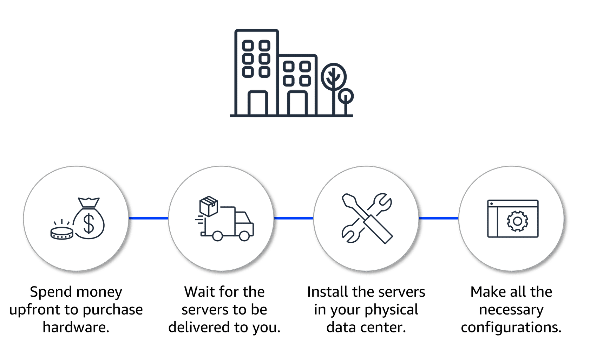
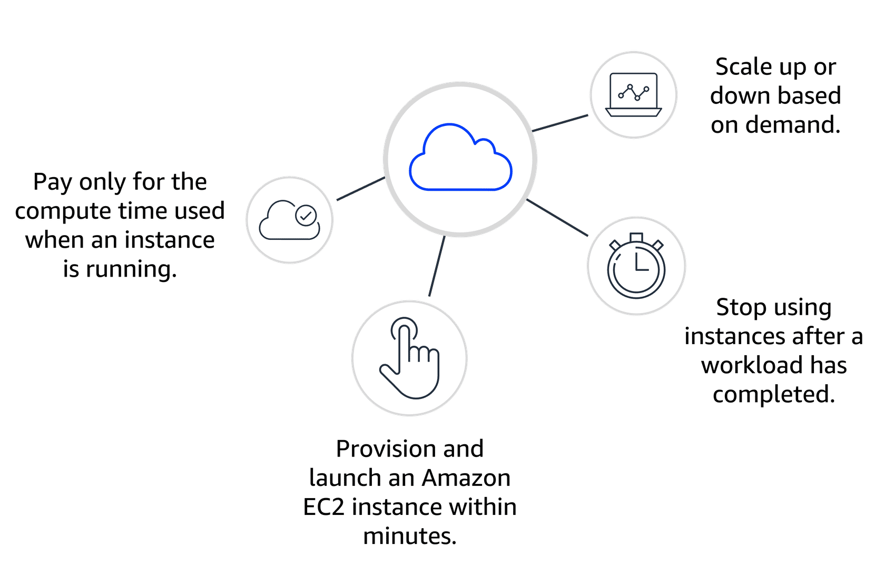
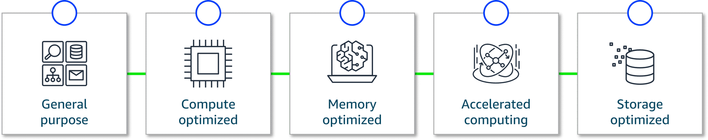
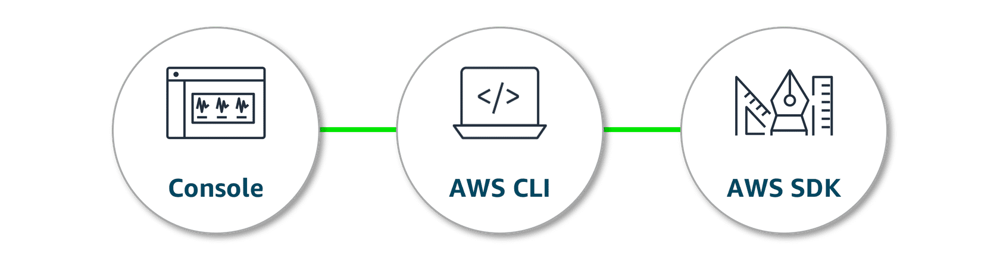
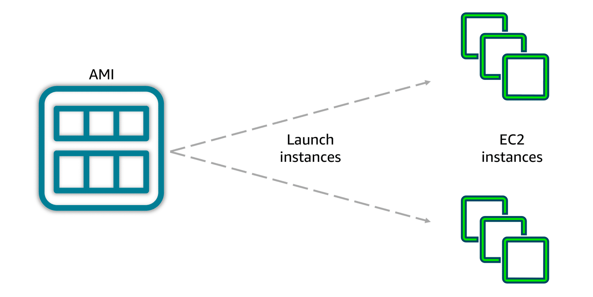
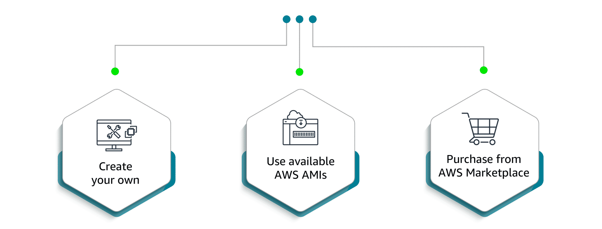
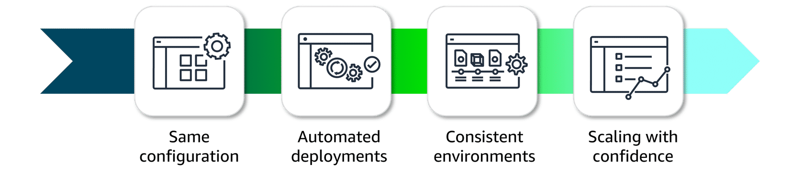

# EC2 (Elastic Compute Cloud) 

- EC2 instances are virtual machines, or VMs. VMs share an underlying physical host machine with multiple other instances, which is a concept called multi-tenancy. In a multi-tenant environment, you need to make sure that each VM is isolated from each other but is still able to share resources provided by the host.

- This job of resource sharing and isolation is being done by a piece of software called a hypervisor, which is running on the host machine. For EC2, AWS manages the underlying host, the hypervisor, and the isolation from instance to instance. So, even though you won't be managing this piece, it's important to have a basic grasp of the concept of multi-tenancy.

- When you provision an EC2 instance, you can choose the operating system, or OS, based on either Windows or Linux. You can provision thousands of EC2 instances on demand, with a blend of operating systems and configurations to power your business' different applications.

- You also can configure what software you want running on the instance. Whether it's your own internal business applications, simple or complex web apps, databases, or third-party software like enterprise software packages, you have complete control over what happens on that instance. You'll see us launch an EC2 instance in an upcoming demo.

- EC2 instances are also resizable. You might start with a small instance and realize the application you are running is starting to max out that server. You can then give that instance more memory and more CPU.  This is what we call vertically scaling an instance. In essence, you can make instances bigger or smaller whenever you need to.

- You only pay for running instances, not stopped or terminated ones.

- AWS took care of the hard part for you, and AWS is constantly operating a massive amount of compute capacity ready to be used. And you can use whatever portion of that capacity when you need it. All you have to do is request the EC2 instances you want, and they will launch and boot up, ready to be used within a few minutes. After you're done, you can stop or terminate the EC2 instances. You're not locked in or stuck with servers that you don't need or want.

## Comparing on-premises and cloud resources
* When designing infrastructure for your business, selecting the right resources can significantly affect your efficiency, flexibility, and overall costs. Review the key differences between on-premises and cloud resource management.

### Challenges of on-premises resources
Imagine that you're responsible for designing your company's infrastructure to support new websites. With traditional on-premises resources, you must purchase hardware upfront, wait for delivery, and handle installation and configuration. This process is time-consuming, costly, and inflexible because you're locked into a specific capacity that might not align with changing demands.
<!-- Simple: two images side-by-side in a white box -->

  

### Benefits of using Cloud Resources
In contrast, with Amazon EC2, you can quickly launch, scale, and stop instances based on your needs without the delays and upfront costs associated with traditional on-premises resources.

  

## How Amazon EC2 works

- You’ve learned that AWS manages complex infrastructure, offering on-demand compute capacity that’s available whenever you need it. You can request EC2 instances and have them ready to use within minutes. 
- With Amazon EC2, you can quickly launch, connect to, and use virtual instances in the cloud. Here's an overview of how the process works: 
    - **Launch an instance** (When launching an EC2 instance, you start by selecting an Amazon Machine Image (AMI), which defines the operating system and might include additional software. You also choose an instance type, which determines the underlying hardware resources, such as CPU, memory, and network performance.).
    - **Connect to the instance** (You can connect to an EC2 instance in various ways. Applications can interact with services running on the instance over the network.Users or administrators can connect using SSH for Linux instances or Remote Desktop Protocol (RDP) for Windows instances. Alternatively, AWS services like AWS Systems Manager offer a secure and simplified method for accessing instances).
    - **Use the instance** (After you are connected to the instance, you can begin using it to run commands, install software, add storage, organize files, and perform other tasks).

    ---

# EC2 Instances Type

  - There are different types of instances that serve different purposes in your AWS environment. Instance types are grouped under instance families, which offer varying combinations of CPU, memory, storage, and networking capacity. This gives you the flexibility to optimize for certain types of tasks by choosing instances specific to your particular workload.

  - The different instance families are general purpose, compute optimized, memory optimized, accelerated computing, and storage optimized.

    > **General purpose** instances provide a good balance of compute, memory, and networking resources. They can be used for lots of diverse workloads, like web services or code repositories. They’re also a good starting point if you don’t know how your workload will perform ahead of time.

    > **Compute-optimized** instances are ideal for compute-intensive tasks, like gaming servers, high-performance computing, machine learning tasks--even scientific modeling.

    > **Memory-optimized** instances are good for memory-intensive tasks. They deliver fast performance for workloads that process large data sets in memory.

    > **Accelerated-computing** instances are good for floating point number calculations, graphics processing, or data pattern matching. This is because they use hardware accelerators. These are co-processors that perform functions more efficiently than is possible in software running on CPUs.

    > **Storage-optimized** instances are ideal for workloads that require high performance for locally stored data.
---

  

---

# Interacting with AWS services

- All interactions with services are powered by APIs. You can access these APIs through three primary methods: the AWS Management Console, the AWS CLI, or the AWS SDK. Let's review these methods.

  

---

  The **AWS Management Console** is a web interface for managing AWS services, offering quick access to services, search functionality, and simplified workflows. With the mobile app, you monitor resources, view alarms, and check billing, supporting multiple logged-in identities at once. Good for Users who prefer a visual, easy-to-use interface for managing and configuring AWS services
  
  With the **AWS CLI**, you manage multiple AWS services directly from the command line across Windows, macOS, and Linux. You can automate tasks through scripts, such as launching EC2 instances.Good for Advanced users and developers who need to automate tasks, script actions, and manage AWS resources efficiently from the command line

  The **AWS SDK**s implifies integrating AWS services into your applications by providing APIs for various programming languages. AWS offers documentation and sample code for languages like C++, Java, and .NET to help you get started.Good for Developers looking to integrate AWS services into their applications using language-specific APIs

  # Compute and shared responsibility

  - The AWS Shared Responsibility Model outlines the division of duties between the customer and AWS. AWS handles the security of the cloud (hardware and infrastructure), whereas the customer is responsible for security in the cloud (applications, data, and access control).

- An unmanaged service like Amazon EC2 requires you to perform all of the necessary security configuration and management tasks. When you deploy an EC2 instance, you are responsible for configuring security, managing the guest operating system (OS), applying updates, and setting up firewalls (security groups). You will learn more about managed and unmanaged services later.
  

  

---
  ## Amazon Machine Images

AMIs are pre-built virtual machine images that have the basic components for what is needed to start an instance. Now, let's explore AMIs in more detail.

 **AMI components**
- An AMI includes the operating system, storage setup, architecture type, permissions for launching, and any extra software that is already installed. You can use one AMI to launch several EC2 instances that all have the same setup.

  

---
**Three ways to use AMIs**
- AMIs can be used in three ways. First, you can create your own by building a custom AMI with specific configurations and software tailored to your needs. Second, you can use pre-configured AWS AMIs, which are set up for common operating systems and software. Lastly, you can purchase AMIs from the AWS Marketplace, where third-party vendors offer specialized software designed for specific use cases.

  

---
**AMI repeatability**
- AMIs provide repeatability through a consistent environment for every new instance. Because configurations are identical and deployments automated, development and testing environments are consistent. This helps when scaling, reduces errors, and streamlines managing large-scale environments. It solves the problem *its wrok on my machine*

  

---
