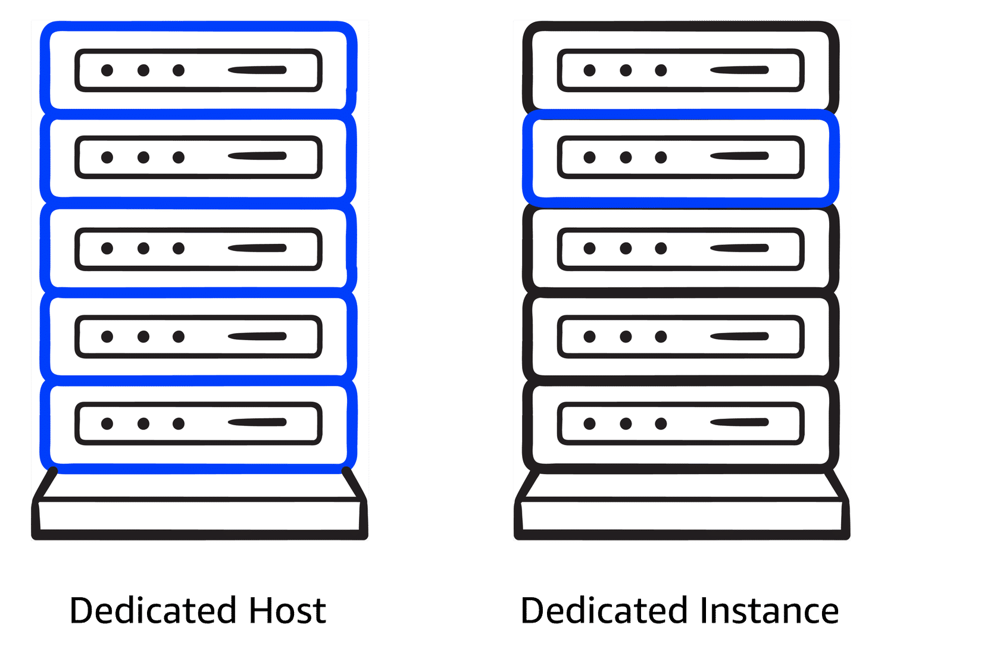

# Amazon EC2 Pricing

EC2 have multiple billing options available.

**On-Demand Instances:**
Pay only for the compute capacity you consume with no upfront payments or long-term commitments required.

**Reserved Instances:**
Get a savings of up to 75 percent by committing to a 1-year or 3-year term for predictable workloads using specific instance families and AWS Regions.

**Spot Instances:**
Bid on spare compute capacity at up to 90 percent off the On-Demand price, with the flexibility to be interrupted when AWS reclaims the instance.

**Savings Plans:**
Save up to 72 percent across a variety of instance types and services by committing to a consistent usage level for 1 or 3 years.

**Dedicated Hosts:**
Reserve an entire physical server for your exclusive use. This option offers full control and is ideal for workloads with strict security or licensing needs.

**Dedicated Instances:**
Pay for instances running on hardware dedicated solely to your account. This option provides isolation from other AWS customers.

## Dedicated Instances VS Dedicated Hosts 

Dedicated Hosts provide exclusive use of physical servers, offering full control over instance placement and resource allocation. This makes them ideal for security- or compliance-driven workloads. But what if you don’t need that level of control?

You could use Dedicated Instances, which offer physical isolation from other AWS accounts while still benefiting from the flexibility and cost savings of shared infrastructure.

The key difference is that Dedicated Instances provide isolation without you choosing which physical server they run on. Dedicated Hosts give you an entire physical server for exclusive use, providing complete control over instance placement and resource allocation.

Ultimately, the right choice depends on your specific workload requirements and the level of control you need over your infrastructure.

  

Dedicated Hosts offer exclusive use of a server with full control, whereas Dedicated Instances provide isolation without server control.

---

## More about cost optimization

To optimize costs and resource allocation, AWS provides various pricing options, including **Savings Plans**, **Amazon EC2 Capacity Reservations**, and **Reserved Instances (RIs)**. Each option is designed to meet specific workload and capacity requirements.

---

**Savings Plans**
**Good for:** Predictable workloads

Savings Plans offer discounts compared to On-Demand rates in exchange for a commitment to use a specified amount of compute power (measured per hour) over a one-year or three-year period. They provide flexible pricing for Amazon EC2, AWS Fargate, AWS Lambda, and Amazon SageMaker AI usage, regardless of instance type or AWS Region. Payment options include All upfront, Partial upfront, or No upfront.

---

**Capacity Reservations**
**Good for:** Critical workloads with strict capacity requirements

With Amazon EC2 Capacity Reservations, you can reserve compute capacity in a specific Availability Zone for critical workloads. These reservations are billed at the On-Demand rate, whether they are used or not. You only pay for the instances you actually run. This option is ideal for workloads with strict capacity needs, whether for current operations or future business-critical projects.

---

**Reserved Instance flexibility**
**Good for:** Steady-state workloads with predictable usage

Reserved Instances (RIs) can provide up to 75% savings compared to On-Demand pricing by applying discounts across different instance sizes and multiple Availability Zones within a Region. When you purchase an RI, AWS automatically applies the discount to other instance sizes in the same family based on the instance size footprint. The discount is also applied across multiple Availability Zones, improving resource distribution and fault tolerance.

---
