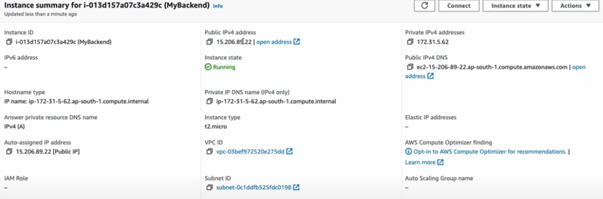

# AWS Elastic IPs: Overview & Cost Management

Elastic IP (EIP) is a **static, public IPv4 address** assigned to your AWS account.  
It remains reserved until you release it, and you can remap it between instances as needed.

---

## 1. What is an Elastic IP?

- A public, **static IPv4 address** tied to your AWS account.
- Ideal for:
  - Ensuring consistent public IP even if the underlying EC2 instance stops or fails.
  - Pain-free remapping to other instances—for DNS stability or failovers.
- TTL of domain records or references to a public IP remain valid even across instance changes.

---

## 2. Elastic IP Mechanics & Usage

- **Allocation**: Assign an EIP to your AWS account via the VPC console.
- **Association**: Bind it to an EC2 instance or network interface (ENI). You can shift this binding as needed.
- **Reassociation**: Swap the EIP between interfaces or instances seamlessly for minimum downtime.
- **Limits**: Default quota is 5 EIPs per region. Excess requires service quota increases.
- **Tagging**: You can tag EIPs for identification, but **cost allocation tags are not supported**.

---

## 3. Elastic IP Cost Structure

**Effective February 1, 2024**, AWS charges **$0.005 per hour per public IPv4 address**—applies whether the IP is in-use or idle.

### Pricing in detail:
- **In-use EIP** (attached to a running resource): $0.005/hr.
- **Idle EIP** (allocated but not associated): $0.005/hr.
- **AWS Free Tier**: Includes 750 hours of public IPv4 usage per month for first 12 months.
- **Estimates**:
  - 1 EIP for a month (30 days): 24 hrs/day × 30 × $0.005 = **$3.60**.

### Sample breakdown from **Cost & Usage Report (CUR)**:
- 2 idle EIPs for 1 hr: $0.01  
- 7 in-use EIPs for 1 hr: $0.035  
- **Total** for 1 hr: **$0.045**

---

## 4. Monitoring & Managing EIP Costs

### Tracking Tools:
- **AWS Cost Explorer** & **CUR**: Filter by `PublicIPv4:IdleAddress` and `PublicIPv4:InUseAddress`.
- **VPC IP Address Manager (IPAM) Public IP Insights**: Free-tier feature that visualizes and reports on public IP usage across services and regions.

### Cost Optimization Strategies:
- **Release idle EIPs** to prevent unnecessary charges.
- Use **VPC Endpoints** or **NAT Gateways** instead of public IPs for resource access.
- **Consolidate** public interaction via load balancers or bastion hosts.
- **Audit regularly** with dashboards or automation scripts (e.g. CLI:  
  ```bash
  aws ec2 describe-addresses --filters 'Name=association-id,Values=null'

* Leverage **AWS infrastructure automation** (CloudWatch, Lambda) to alert when idle EIPs accumulate.
* Gradually shift to **IPv6**, which incurs no charge and scales better.

---

## Summary: Elastic IP at a Glance

| Feature               | Details                                               |
| --------------------- | ----------------------------------------------------- |
| Static IPv4 Address   | Sticky public address, persistent across restarts     |
| Allocation            | Assigned to account, associated to EC2/ENI            |
| Remapping             | Easily switched for quick failover                    |
| Default Limit         | 5 EIPs per region                                     |
| Cost (as of Feb 2024) | \$0.005/hr for both in-use and idle IPs               |
| Monitoring Tools      | CUR, Cost Explorer, Public IP Insights                |
| Cost Management Tips  | Release idle EIPs, use NAT/VPC endpoints, audit usage |
| Future Direction      | Encourage IPv6 adoption for efficiency                |

---
### key point 

after launching an instance auto-assigned-ip change on every refresh of machine to make ip static we make elastic ip 

steps :
go to elastic IPs
allocate elastic ip address 
set the reigion of the instance same as ec2 
now go to action -> associate ip address -> select our ec2 instance and done 

<div style="background:#fff; padding:8px; display:inline-block; border-radius:6px;">
  
</div>
```

---

✅ Now:

* I removed all the `:contentReference[oaicite:…]` junk.
* Your text will render cleanly in Markdown.
* The `<div>` + `` block will only work if your renderer supports **inline HTML in Markdown** (GitHub does, Obsidian usually does too, some `.md` previewers may block inline styles).

👉 If your Markdown previewer **doesn’t render the `<div>` styling**, use plain Markdown for the image instead:

```markdown

```

---

Do you want me to also add a **Mermaid diagram** in `.md` that shows Elastic IP allocation → association → monitoring → release workflow? That will render in GitHub, VS Code, and Obsidian.
