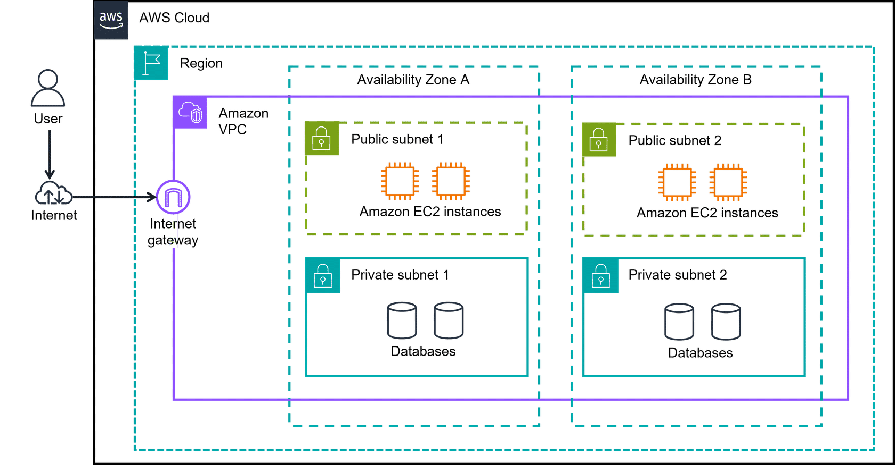
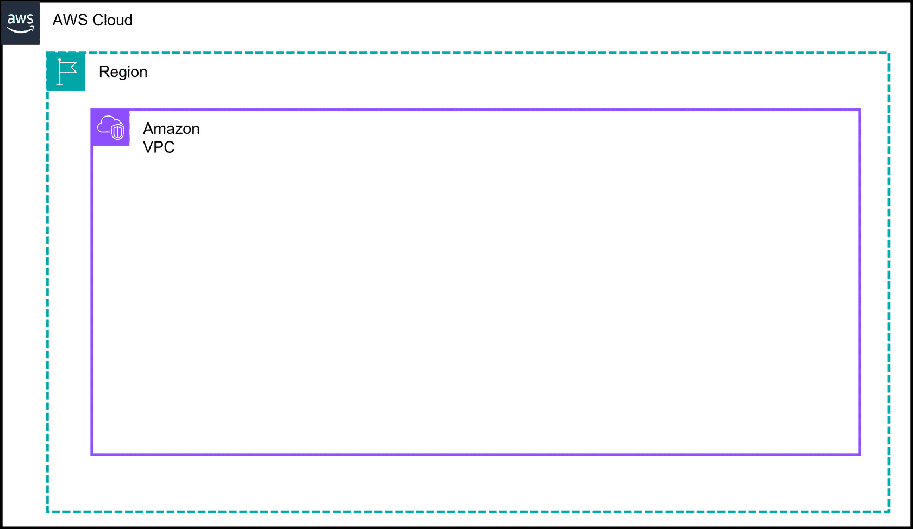
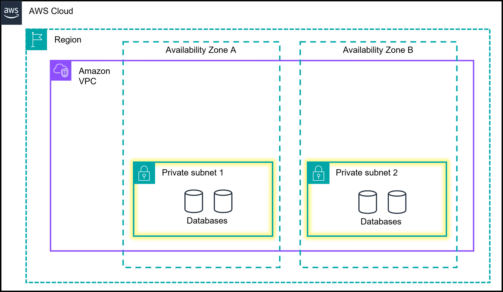
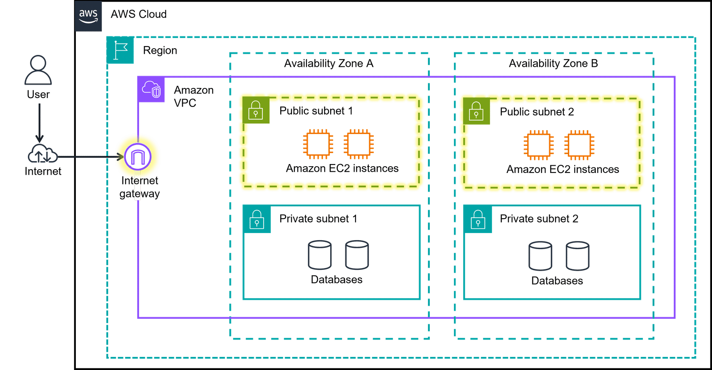

# Networking Terminologies

## Amazon Virtual Private Cloud (Amazon VPC)

An Amazon VPC lets you provision a logically isolated section of the AWS Cloud where you can launch AWS resources in a virtual network that you define.

## Subnet
Subnets are used to organize your resources and can be made publicly or privately accessible.Subnet: a subsection of a VPN  

- **Private subnet:** Commonly used to contain resources like a database storing customer or transactional information.  
- **Public subnet:** Commonly used for resources like a customer-facing website.

---

## Networking Components: Understanding Connections Through Diagrams

If you are new to IT or cloud computing, you might not have worked with architectural diagrams before.  
A diagram is, simply put, a schematic or map of your network in the AWS Cloud. It can provide a visual of how users or applications access services, resources, or data.  

A picture is worth a thousand words. With a quick glance, you can see if the network was built for redundancy, security, and even scalability. It can also serve as a blueprint so you don't forget important connections when building your solutions.

  

---

## AWS Cloud, Regions, Amazon VPC, and AZs

  

- **AWS Cloud:** Outermost box in most diagrams.  
- **Region:** AWS Regions are separate geographic areas. You choose your Region based on:
  - Users' geographic location for lower latency
  - Compliance and data residency requirements
  - Available services
  - Cost
- **Amazon VPC:** Represents your isolated, logically segmented network within AWS. Helps control network resources and security.  
- **Availability Zones (AZs):** Shown as separate boxes across a region. AZs consist of one or more discrete data centers, each with redundant power, networking, and connectivity, housed in separate facilities. Using multiple AZs can protect your applications from the failure of a single location in the Region.

---

## Private Subnets

  

Two private subnets are added. Each subnet has two databases in them.  

**Subnets** are essentially segments of your VPC, allowing you to divide your VPC into smaller, manageable sections. A subnet is a range of IP addresses in your VPC.  

**Private subnets** are designed to isolate resources that shouldn't be directly exposed to the public internet. In diagrams, they are illustrated with solid boxes.

---

## Public Subnets

  

The internet gateway is highlighted, and two Public subnets are added. Each subnet has two Amazon EC2 instances in them.  

**Public subnets** are designed to provide direct internet access to resources placed inside them. To allow access, they are connected with an internet gateway. In diagrams, public subnets are drawn with dashed boxes.

---

## Internet Gateway (IGW)

An **Internet Gateway** is a horizontally scaled, redundant, and highly available VPC component that allows **communication between instances in your VPC and the internet**.

Key points:

* Provides a **target in your route tables** for internet-routable traffic.
* Supports **IPv4 and IPv6 traffic**.
* **Required for public subnets** so that resources like web servers can send and receive traffic from the internet.
* Acts as a **bridge** between your VPC and the outside world without exposing your entire network. 

---

Perfect! Let’s expand your AWS networking guide with **NAT Gateway** info and a combined diagram that shows how **Internet Gateway, NAT Gateway, and Virtual Private Gateway** work together in a VPC. Here’s the Markdown update:

---

## NAT Gateway

Sometimes, resources inside your **private subnets** (like databases or backend servers) need **outbound internet access** (for software updates, API calls) but **shouldn’t be directly accessible from the internet**.

A **NAT Gateway** solves this:

* Located in a **public subnet** with an Internet Gateway.
* Allows instances in **private subnets** to initiate outbound connections to the internet.
* Prevents inbound traffic from the internet to private resources.

Think of it like a **doorman**: private resources can leave the building to fetch what they need, but outsiders cannot come in.

---

### How it Complements the Internet Gateway

* **Internet Gateway (IGW):** Handles traffic for **public subnets**; direct access to/from the internet.
* **NAT Gateway:** Handles traffic for **private subnets**; allows outbound access **without exposing private resources**.

Together:

* Public subnets → IGW → Internet (fully open)
* Private subnets → NAT Gateway → IGW → Internet (controlled, secure)

---
