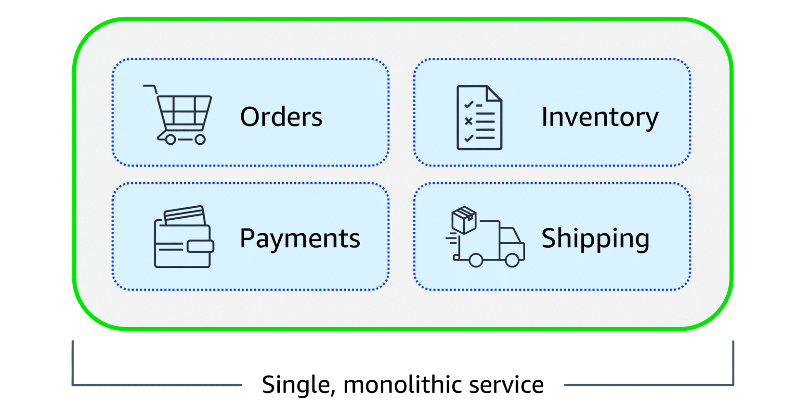
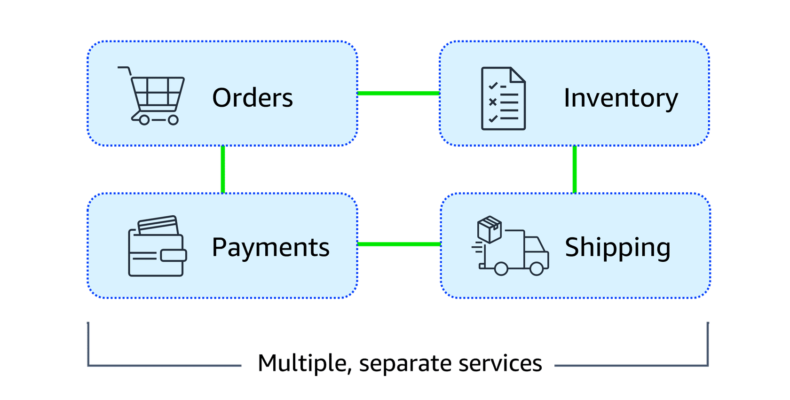

# AWS Messaging Services: Amazon SQS and Amazon SNS Guide

## Table of Contents

1. [Introduction to Application Architectures](#introduction-to-application-architectures)
   - [Monolithic Applications](#monolithic-applications)
   - [Microservices Architecture](#microservices-architecture)
2. [Loosely Coupled Architectures with Message Queues](#loosely-coupled-architectures-with-message-queues)
3. [Overview of Amazon SQS and Amazon SNS](#overview-of-amazon-sqs-and-amazon-sns)
   - [Amazon SQS](#amazon-sqs)
   - [Amazon SNS](#amazon-sns)
4. [Supporting Scalable and Reliable Cloud Communication](#supporting-scalable-and-reliable-cloud-communication)
   - [Amazon EventBridge](#amazon-eventbridge)
5. [Analogies for SQS and SNS](#analogies-for-sqs-and-sns)
   - [SQS Analogy](#sqs-analogy)
   - [SNS Analogy](#sns-analogy)
   - [Generalized Analogy](#generalized-analogy)
   - [Coffee Shop Analogy](#coffee-shop-analogy)
6. [Fan-Out Pattern in AWS](#fan-out-pattern-in-aws)
   - [What is Fan-Out?](#what-is-fan-out)
   - [How Fan-Out Works with SNS and SQS](#how-fan-out-works-with-sns-and-sqs)
   - [Fan-Out Analogy](#fan-out-analogy)
   - [Use Cases for Fan-Out](#use-cases-for-fan-out)
   - [Detailed Fan-Out Architecture Example: E-Commerce Order Processing](#detailed-fan-out-architecture-example-e-commerce-order-processing)
7. [Conclusion](#conclusion)

This guide provides a progressive overview of Amazon Simple Queue Service (SQS) and Amazon Simple Notification Service (SNS), starting with foundational concepts in application architectures and advancing to practical patterns like fan-out. It explains how these services enable decoupled, scalable, and reliable communication in cloud applications. Where relevant, analogies and examples are included for clarity.

---

## Introduction to Application Architectures

Modern applications are composed of multiple components that interact to process data, handle requests, and maintain functionality. The architecture chosen—monolithic or microservices—significantly impacts scalability, resilience, and maintainability.

### Monolithic Applications

In monolithic applications, components such as database logic, web servers, user interfaces, and business logic are tightly coupled. A failure in one component can cascade, potentially disrupting the entire system.

<div style="background:#fff; padding:8px; display:inline-block; border-radius:6px;">
  
</div>

### Microservices Architecture

Microservices architecture promotes loosely coupled components, where a failure in one does not affect others. This enhances availability, flexibility, and reliability, as communication between services remains intact.

<div style="background:#fff; padding:8px; display:inline-block; border-radius:6px;">
  
</div>

---

## Loosely Coupled Architectures with Message Queues

In tightly coupled systems, direct communication (e.g., Application A sending messages to Application B) can lead to errors if one fails. To achieve loose coupling, introduce a buffer like a message queue: Application A sends messages to the queue, and Application B processes them when available. If Application B fails, Application A remains unaffected, as messages persist in the queue.

This decoupling is a core principle in AWS architectures, enabled by services like Amazon SQS (for queuing) and Amazon SNS (for notifications).

---

## Overview of Amazon SQS and Amazon SNS

Amazon SQS and SNS are managed messaging services that facilitate reliable, scalable communication between application components.

### Amazon SQS

Amazon SQS is a fully managed message queuing service that enables sending, storing, and receiving messages at any scale without loss. Applications place messages in a queue; consumers retrieve, process, and delete them. It ensures components remain decoupled and available independently.

### Amazon SNS

Amazon SNS is a publish-subscribe (pub/sub) service where publishers send messages to topics, and subscribers (e.g., web servers, email addresses, Lambda functions, or other endpoints) receive them immediately. Unlike SQS, SNS requires real-time responses and does not store messages for later retrieval.

---

## Supporting Scalable and Reliable Cloud Communication

Amazon EventBridge, SNS, and SQS work together to build event-driven and message-based systems, supporting high-traffic applications with efficient inter-component communication.

### Amazon EventBridge

EventBridge is a serverless service for connecting applications via events. It routes events from sources (e.g., AWS services, custom apps, or third-party software) to targets, handling filtering, transformation, and delivery. This simplifies building scalable, reliable event-driven architectures.

---

## Analogies for SQS and SNS

To illustrate the differences, consider these analogies.

### SQS Analogy

Think of SQS as a **to-do list or task board**:
- Messages (tasks) are added in order.
- Each consumer (worker) picks one message, processes it, and removes it.
- Messages are delivered to exactly one consumer.

Use case: Reliable, decoupled, one-to-one communication.

### SNS Analogy

Think of SNS as a **loudspeaker or group announcement**:
- A message is broadcasted.
- All subscribers receive their own copy simultaneously.

Use case: Notifications, fan-out, one-to-many communication.

### Generalized Analogy

- **SQS**: A task queue where workers handle jobs sequentially.
- **SNS**: An announcement system broadcasting to multiple listeners.

### Coffee Shop Analogy

- **SQS**: Orders on a board; each barista takes one to fulfill.
- **SNS**: A barista shouts an announcement; all relevant parties (customers, staff) hear it at once.

---

## Fan-Out Pattern in AWS

The fan-out pattern distributes a single message to multiple destinations simultaneously, enhancing efficiency in decoupled systems.

### What is Fan-Out?

In messaging systems, fan-out refers to broadcasting one message to multiple recipients. In AWS, this is achieved by publishing to an SNS topic, which copies and delivers the message to all subscribers.

### How Fan-Out Works with SNS and SQS

- Publish a message to an SNS topic.
- The topic has multiple subscribers (e.g., SQS queues, Lambda functions, HTTP endpoints).
- SNS fans out the message, delivering a copy to each subscriber in parallel.

This avoids manual duplication, enabling one-to-many communication.

### Fan-Out Analogy

Imagine a teacher making an announcement:
- Write one message.
- Broadcast it once.
- All students (subscribers) receive it simultaneously.

### Use Cases for Fan-Out

- Event notifications triggering multiple systems.
- Logging where data goes to storage, alerts, and dashboards.
- Microservices where an event (e.g., new order) notifies billing, inventory, and shipping.

### Detailed Fan-Out Architecture Example: E-Commerce Order Processing

In an e-commerce platform, fan-out ensures efficient handling of events like a new order placement. Here's a step-by-step architecture using SNS and SQS, with an example workflow.

#### Architecture Overview

- **Components**:
  - **Order Service**: Publishes a "New Order" event to an SNS topic.
  - **SNS Topic** (e.g., "OrderEventsTopic"): Receives the message and fans it out.
  - **Subscribers** (SQS Queues and Other Services):
    - **Inventory Queue (SQS)**: Processes stock updates.
    - **Billing Queue (SQS)**: Handles payment processing.
    - **Shipping Queue (SQS)**: Prepares logistics.
    - **Notification Service (e.g., Lambda or Email Endpoint)**: Sends customer confirmations.
    - **Analytics Service (e.g., Lambda)**: Logs for reporting.

- **Workflow**:
  1. A customer places an order via the website or app. The Order Service generates a JSON message with details (e.g., order ID, items, customer info).
  2. The Order Service publishes the message to the SNS topic.
  3. SNS fans out the message:
     - Copies it to the Inventory Queue for stock deduction.
     - Copies it to the Billing Queue for charging the customer.
     - Copies it to the Shipping Queue for label generation and carrier notification.
     - Copies it to the Notification Service for emailing/SMSing the customer.
     - Copies it to the Analytics Service for updating dashboards.
  4. Each subscriber processes its copy independently:
     - Inventory Service polls its SQS queue, updates stock levels, and deletes the message.
     - Billing Service processes payment and integrates with a payment gateway.
     - Shipping Service coordinates with fulfillment centers.
     - Notification and Analytics handle their tasks in parallel.
  5. If any subscriber fails (e.g., Billing Service downtime), the message persists in its SQS queue for retry, without affecting others.

#### Benefits in E-Commerce

- **Scalability**: During peak sales (e.g., Black Friday), SNS handles high-volume publishing, and SQS queues buffer workloads.
- **Resilience**: Loose coupling prevents a failure in shipping from blocking billing.
- **Efficiency**: One publish operation triggers multiple actions, reducing code complexity.
- **Cost-Effectiveness**: Pay only for messages processed; auto-scaling handles traffic spikes.

#### Textual Diagram

```
[Customer Places Order] --> [Order Service] --> Publish Message --> [SNS Topic: OrderEventsTopic]

SNS Fans Out (Parallel Delivery):
  ├──> [SQS: Inventory Queue] --> [Inventory Service] (Update Stock)
  ├──> [SQS: Billing Queue] --> [Billing Service] (Process Payment)
  ├──> [SQS: Shipping Queue] --> [Shipping Service] (Prepare Shipment)
  ├──> [Lambda: Notification] (Send Email/SMS)
  └──> [Lambda: Analytics] (Log for Reporting)
```

#### Implementation Notes

- Use AWS SDK to publish to SNS from the Order Service (e.g., in Python: `sns.publish(TopicArn='arn:aws:sns:region:account:OrderEventsTopic', Message=json.dumps(order_data))`).
- Subscribe SQS queues to the SNS topic via the AWS Console or CLI.
- Configure dead-letter queues in SQS for failed messages.
- Monitor with Amazon CloudWatch for metrics like message throughput and queue depth.

This architecture decouples services, allowing independent scaling (e.g., more workers for Shipping Queue during holidays) and fault isolation.

---

# Understanding this Event-Driven Order Processing with Fan-Out Pattern in AWS

---

<div style="background:#fff; padding:8px; display:inline-block; border-radius:6px;">
  
</div>

### Overview of the Diagram

This diagram illustrates a **fan-out architecture** in AWS, commonly used in event-driven systems like e-commerce order processing. It shows how a single incoming event (e.g., a new order) is received, acknowledged, and then "fanned out" (distributed) to multiple downstream services for parallel, decoupled processing. This pattern leverages AWS services to ensure scalability, reliability, and loose coupling: one message triggers multiple independent workflows without direct dependencies.

The key services involved are:
- **API Gateway**: Handles incoming HTTP requests as a RESTful entry point.
- **AWS Lambda**: Serverless compute for processing logic (e.g., order acknowledgment and publishing messages).
- **Amazon SNS (Simple Notification Service)**: Acts as the central publisher for fan-out, broadcasting messages to subscribers.
- **Amazon SQS (Simple Queue Service)**: Queues that buffer messages for asynchronous, poll-based consumption.
- **DynamoDB**: A NoSQL database (represented as the "Order Table") for persistent storage.

The diagram emphasizes **poll-based processing** (where consumers actively poll queues for messages) and includes an **event filter** to route messages selectively. I'll break it down step by step, following the flow from left to right.

### Step-by-Step Explanation of the Flow

1. **Client Application Initiates the Request**:
   - The process starts on the left with a "Client Application" (e.g., a web or mobile app where a user places an order).
   - The client sends an **HTTP Call** (e.g., a POST request with order details) to **API Gateway REST**.
   - API Gateway serves as a secure, scalable API endpoint. It handles authentication, throttling, and routing, then invokes the next component.

2. **Order Acknowledgment Microservice (Lambda)**:
   - API Gateway triggers an **AWS Lambda function** labeled "Order Acknowledgment Microservice."
   - This Lambda processes the incoming request:
     - Validates and acknowledges the order (e.g., checks inventory availability or user details).
     - Publishes a message to **Amazon SNS** with event details (e.g., a JSON payload like `{ "EventType": "NewOrder", "OrderID": "12345", ... }`).
   - Simultaneously, the Lambda writes the order data directly to the **Order Table** (a DynamoDB table at the bottom of the diagram). This ensures persistent storage of the order for querying or auditing.
   - The downward arrow to the Order Table indicates synchronous persistence, separate from the asynchronous fan-out.

3. **Publishing to Amazon SNS**:
   - The Lambda "Publishes Message" to an **Amazon SNS topic**.
   - SNS is a pub/sub service that receives the message and prepares to distribute it to subscribers.
   - An **Event Filter** (shown with a ✓ for matched events and × for filtered out) is applied here. This is SNS subscription filtering: messages are routed based on attributes (e.g., "EventType"). Only matching messages proceed to specific subscribers, preventing unnecessary processing.

4. **Fan-Out from SNS to Multiple SQS Queues**:
   - This is the core "fan-out" part: SNS broadcasts (copies) the message to multiple subscribers in parallel.
   - The diagram shows three branches, each representing a separate workflow triggered by the same event:
     - **Top Branch: Notification Workflow**:
       - SNS sends the message to an **SQS Queue** (if it matches the filter, e.g., "EventType = Poll-Based").
       - A consumer (likely another Lambda) polls the queue ("Poll-Based") and processes the message.
       - Output: Triggers a "Notification" (e.g., sending an email or push notification to the customer confirming the order).
     - **Middle Branch: Inventory Workflow**:
       - Similar to above: SNS → SQS Queue → Poll-Based polling.
       - Processes "Inventory" updates (e.g., deducts stock levels for the ordered items).
     - **Bottom Branch: Shipment Workflow**:
       - SNS → SQS Queue → Poll-Based polling.
       - Handles "Shipment" logic (e.g., generates shipping labels or notifies a fulfillment center).
   - Each branch is labeled "EventType = Poll-Based," indicating that the fan-out is for poll-based events, where consumers (e.g., Lambda functions) actively check the SQS queues for new messages rather than receiving pushes.
   - The circular icons represent message routing/delivery, and the play icons (▶) symbolize polling/processing.

5. **End of the Flow**:
   - Once processed, messages are deleted from the SQS queues to avoid reprocessing.
   - The workflows run asynchronously and independently: If the shipment service is slow or fails temporarily, it doesn't block notifications or inventory updates.
   - The Order Table (DynamoDB) can be queried later by any service for order status.

### Key Concepts Demonstrated

- **Fan-Out Pattern**: A single SNS publish triggers multiple parallel actions (notification, inventory, shipment), reducing latency and improving scalability. This is ideal for e-commerce, where one order event affects multiple systems.
- **Decoupling**: Services (e.g., inventory and shipment) don't communicate directly; SNS/SQS acts as a buffer, allowing independent scaling or failure handling.
- **Poll-Based vs. Push-Based**: The diagram highlights polling (consumers pull from SQS), which is reliable for variable workloads but may introduce slight delays compared to push notifications.
- **Event Filtering**: Ensures only relevant messages reach each queue (e.g., filter by "EventType" to route order confirmations vs. cancellations).
- **Serverless and Managed**: All components (API Gateway, Lambda, SNS, SQS, DynamoDB) are fully managed by AWS, with auto-scaling and pay-per-use pricing.

### Benefits in a Real-World Scenario (E-Commerce Example)

In an online store:
- A customer orders a product → API Gateway/Lambda acknowledges and stores it in DynamoDB.
- SNS fans out: 
  - Notification queue sends a "Order Confirmed" email.
  - Inventory queue updates stock to prevent overselling.
  - Shipment queue prepares for delivery.
- This handles high traffic (e.g., during sales) without bottlenecks, and if one queue backs up, others proceed.

---

## Conclusion

This guide progresses from basic architectures to advanced patterns like fan-out, demonstrating how SQS and SNS enable robust, decoupled systems. In e-commerce and beyond, these services reduce complexity while improving reliability. For hands-on implementation, refer to AWS documentation and experiment in the Free Tier.

---


# Poll-Based vs Push-Based Messaging

## 1. Poll-Based Messaging
- **Definition**: Consumers periodically check (poll) the broker/queue for new messages.  
- **Workflow**:
  1. Producer sends message to the broker (e.g., Kafka, SQS).
  2. Broker stores the message.
  3. Consumer *actively requests* (polls) the broker for new messages.
  4. Consumer processes the messages and acknowledges receipt.
- **Pros**:
  - Consumer has full control over message consumption rate.
  - Easier error handling (retry logic handled on consumer side).
  - Good for high-throughput systems like **Kafka**.
- **Cons**:
  - Can introduce latency (depends on polling frequency).
  - Wastes resources if polling returns no new messages.

---

## 2. Push-Based Messaging
- **Definition**: Broker pushes messages directly to consumers without them polling.  
- **Workflow**:
  1. Producer sends message to broker.
  2. Broker immediately delivers (pushes) message to subscribed consumers.
  3. Consumer processes message on arrival.
- **Pros**:
  - Lower latency (real-time delivery).
  - No unnecessary polling overhead.
  - Useful for **event-driven architectures** (e.g., SNS → Lambda).
- **Cons**:
  - Consumer may be overwhelmed if messages arrive too quickly.
  - Harder to implement flow control/backpressure.
  - Retry/error handling often needs extra configuration.

---

## 3. Real-World Examples
- **Poll-Based**:
  - Apache Kafka consumers (`consumer.poll()` API).
  - Amazon SQS standard queue consumers.
- **Push-Based**:
  - Amazon SNS → Lambda (messages pushed to subscriber).
  - Webhooks from APIs (GitHub → your app).

---

## 4. Use Cases
- **Poll-Based**:
  - High-throughput pipelines (data ingestion, logs, streaming analytics).
  - Systems where consumers want control over processing rate.
- **Push-Based**:
  - Notification systems (emails, SMS, alerts).
  - Event-driven microservices (react to specific triggers in real time).
