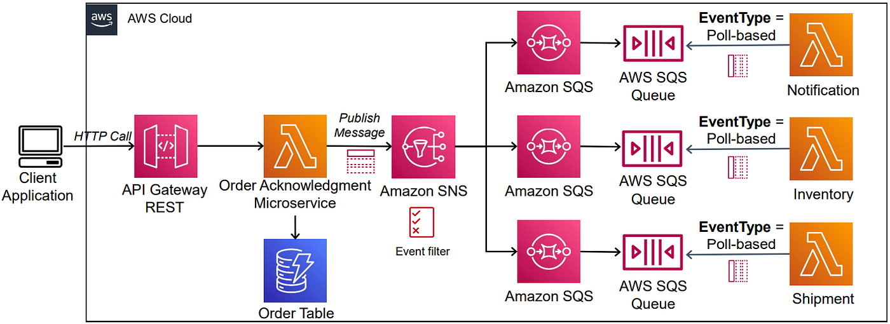

Perfect 👍 You want the same **AWS Lambda explanation** but without the crab analogy/example — instead making it **general, topic-based, and professional**. Here’s the restructured version:

---

# AWS Lambda (Serverless Compute Service)

## 1. Introduction to Lambda

* AWS **Lambda** is a **serverless compute service**, also referred to as **Function as a Service (FaaS)**.
* It allows you to **run code without provisioning or managing servers**.
* You only write and deploy your function, and AWS handles the infrastructure.

---

## 2. How Lambda Works

* You create a **Lambda function** and upload your code.
* You configure **triggers** that determine when the function should run.
* The function executes automatically in response to these triggers.

---

## 3. Triggers in Lambda

* Lambda can be invoked by many AWS services and events, such as:

  * File uploads (e.g., via Amazon S3)
  * Database events (e.g., DynamoDB streams)
  * HTTP requests (via API Gateway)
  * Real-time data streams (e.g., Amazon Kinesis)
  * Scheduled events (via CloudWatch)

---

## 4. Scalability and Availability

* Lambda automatically **scales up or down** based on demand.
* It is inherently **highly available** because AWS manages the execution environment globally.

---

## 5. Management and Security

* AWS handles:

  * Infrastructure provisioning
  * Patching and updates
  * Security of the environment
* You only focus on your **application code**.

---

## 6. Execution Model and Limits

* Each function runs in a **fully managed runtime environment**.
* **Maximum execution time**: 15 minutes per invocation.
* Best suited for **short-lived, event-driven tasks**.

---

## 7. Use Cases

* Event-driven applications
* Web request handling
* Batch data processing
* Real-time file or stream processing
* Report generation and automation tasks

---

## 8. Language Support

* Lambda supports multiple languages via **runtimes**, such as:

  * Node.js
  * Python
  * Java
  * C# (.NET Core)
  * Go
  * Ruby
* You can also create **custom runtimes** for other programming languages.

---

## 9. Integration with AWS Services

* Lambda integrates natively with many AWS services:

  * **API Gateway** (to handle API requests)
  * **S3** (to process uploaded files)
  * **DynamoDB** (to react to database changes)
  * **CloudWatch** (for logs, metrics, and scheduled events)
  * **SNS/SQS** (for messaging and queue processing)

  

---

## 10. Key Takeaway

AWS Lambda enables **event-driven, serverless computing** where you:

* Don’t manage servers
* Pay only for execution time
* Scale automatically
* Focus entirely on your **business logic and code**

Lambda is a serverless compute service that runs code in response to events without the need to provision or manage servers. It automatically manages the underlying infrastructure, scaling resources based on the volume of requests. You are charged only for the compute time consumed, down to the millisecond. Lambda handles execution, scaling, and resource allocation. You can optimize performance by configuring the appropriate memory size for your function.
