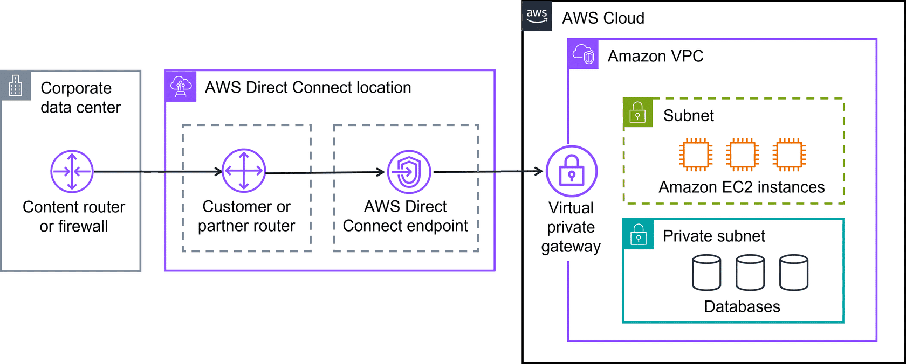

# Connecting to the AWS Cloud

With so many types of networks, on-premises data centers, and remote workers, companies need multiple ways to connect to the AWS Cloud. The main methods are:

* **AWS Client VPN**
* **AWS Site-to-Site VPN**
* **AWS PrivateLink**
* **AWS Direct Connect**

---

## AWS Client VPN

Securely connect a remote workforce to AWS Cloud resources.
AWS Client VPN is a fully managed, elastic VPN service that scales automatically based on demand.

**Benefits:**

* Advanced authentication and remote access
* Elastic and fully managed

**Use Case:** Quickly scale remote-worker access

  
  Client Internet Gateway

  

Client VPN uses an OpenVPN-based client and works across AWS global Regions. It provides secure access to AWS resources and on-premises networks from anywhere.

---

## AWS Site-to-Site VPN

Securely connect on-premises networks (like data centers or branch offices) to Amazon VPCs.

**Benefits:**

* High availability
* Secure and private sessions
* Accelerates applications

**Use Case:** Application migration and secure inter-site communication

  
  Site-to-Site VPN

---

## AWS PrivateLink

Privately connect your VPC to AWS services or other VPCs without using an internet gateway, NAT device, or VPN.

**Benefits:**

* Secures traffic
* Simplifies connection management

**Use Case:** Connect clients in your VPC to other resources, services, or endpoints

---

## AWS Direct Connect

Establish a **dedicated private connection** between your network and AWS VPC.

**Benefits:**

* Reduced network costs
* Increased bandwidth
* Consistent low-latency network

  
  Direct Connect

  

**Use Cases:**

1. **Latency-sensitive applications** – Ideal for video streaming or real-time applications
2. **Large-scale data migration** – Smooth, reliable transfers for backups or analytics
3. **Hybrid cloud architectures** – Connect on-premises and AWS environments securely

---

## Additional Gateway Services

### AWS Transit Gateway

Connects multiple Amazon VPCs and on-premises networks through a central hub. Global inter-Region peering connects transit gateways using AWS Global Infrastructure.

### NAT Gateway

Allows instances in **private subnets** to access services outside your VPC, while preventing inbound traffic from external sources.

### Amazon API Gateway

A managed service to create, publish, maintain, monitor, and secure APIs at scale.

---

## Summary of Connectivity Options

| Service                  | Description                                                      |
| ------------------------ | ---------------------------------------------------------------- |
| **AWS Direct Connect**   | Private, dedicated AWS connection to your data center or office  |
| **AWS Client VPN**       | Connects remote workforce to AWS or on-premises networks via VPN |
| **AWS Site-to-Site VPN** | Encrypted network connection to Amazon VPCs                      |
| **AWS PrivateLink**      | Privately connects your VPC to services and resources            |

---

