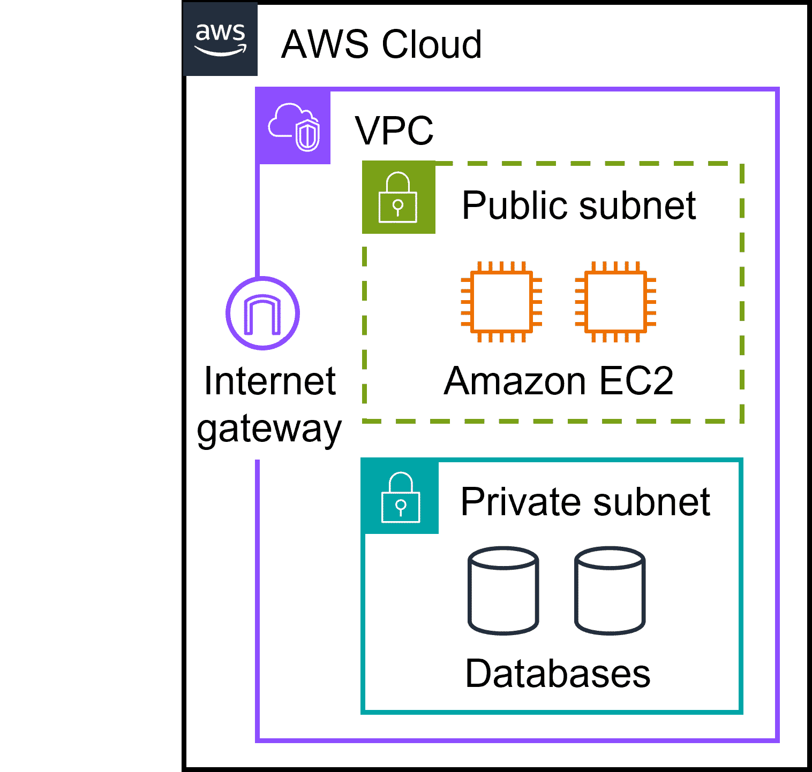
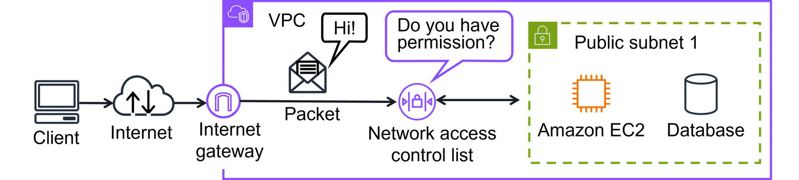
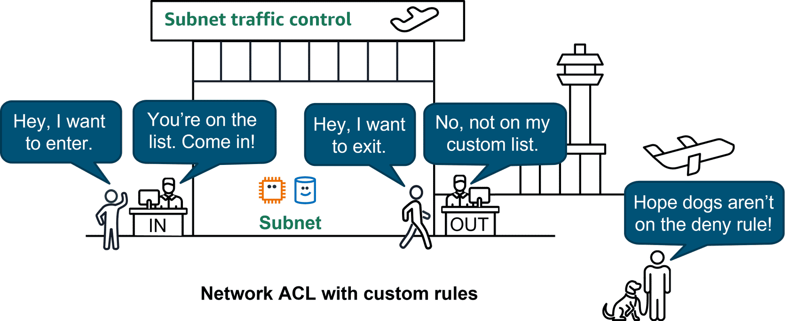
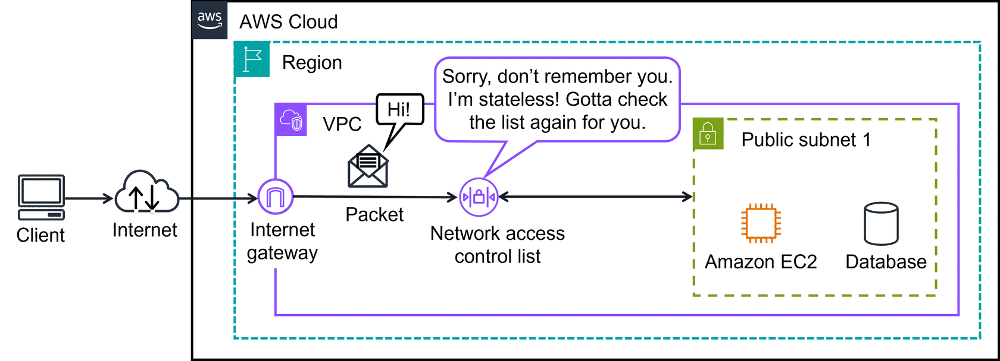
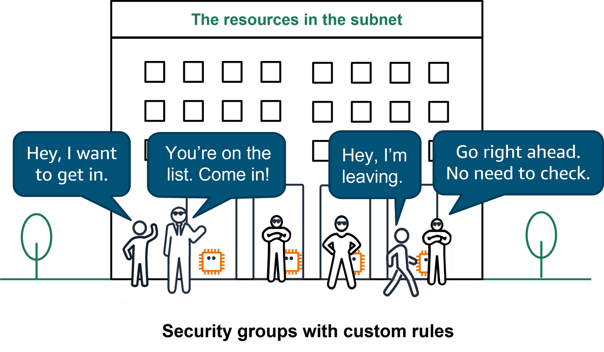
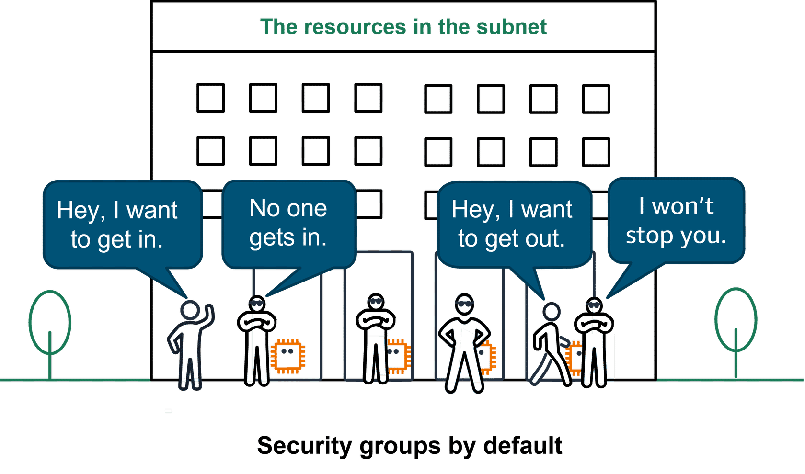
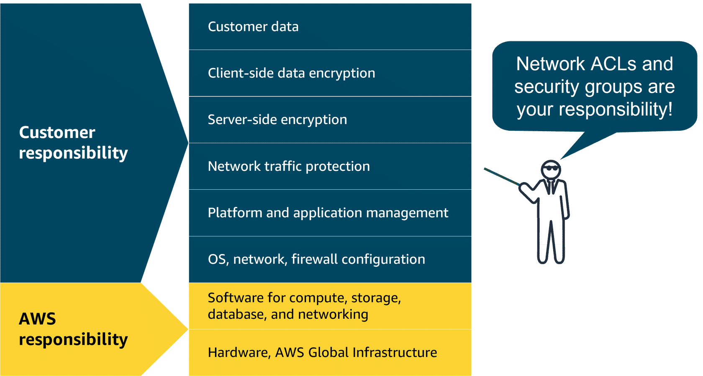

# Subnets, Security Groups, and Network Access Control Lists (NACLs)

## 1. Subnets

A **subnet** is a section of a VPC in which you can group resources based on **security or operational needs**.

* **Public Subnet** → For resources that need internet access (e.g., web servers).
* **Private Subnet** → For resources that should not be directly accessible from the internet (e.g., databases).

  

---

## 2. Network Traffic in a VPC

* **Packets** = Units of data traveling across a network.
* Enter a VPC through an **internet gateway**.
* Checked by **Network ACLs (NACLs)** before entering/exiting subnets.

  

---

## 3. Network ACLs (NACLs)

A **Network ACL** is a **virtual firewall** that controls inbound/outbound traffic **at the subnet level**.

* **Default NACL** → Allows all inbound/outbound traffic.
* **Custom NACL** → Denies all until rules are added.
* **Explicit Deny Rule** → If no rule matches, deny traffic.
* **Stateless** → Doesn’t remember previous packets, checks each one independently.

### Default NACL Example

  

### Custom NACL Example

  

### Stateless Filtering Example

  

---

## 4. Security Groups

A **Security Group** is a **virtual firewall at the instance level (e.g., EC2)**.

* **Default Behavior**:

  * Inbound → Denies all
  * Outbound → Allows all
* **Custom Rules**: Only *allow* rules (no deny).
* **Stateful**: Remembers past traffic → return traffic is auto-allowed.

### Default Security Group Example

  

### Custom Security Group Example

  

### Stateful Filtering Example

  

---

## 5. Security Groups vs NACLs

| Feature            | Security Groups      | Network ACLs               |
| ------------------ | -------------------- | -------------------------- |
| **Scope**          | Instance level (EC2) | Subnet level               |
| **State**          | Stateful (remembers) | Stateless (forgets)        |
| **Rules**          | Allow only           | Allow + Deny               |
| **Return Traffic** | Auto allowed         | Must be explicitly allowed |
| **Best Use**       | Fine-grained control | Broad subnet-level control |

---

## 6. AWS Shared Responsibility

* AWS secures the **infrastructure**.
* You configure **NACLs + Security Groups** to secure **your resources**.

  

---