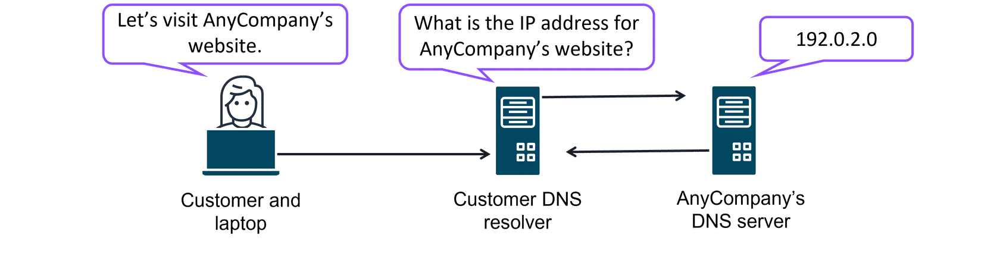

# Edge Networking Services

## Edge Networking Overview

* Brings **storage & compute** closer to devices & users.
* Reduces **latency**, improves **responsiveness**, keeps better **control**.
* Examples: **DNS (Amazon Route 53), CDN (CloudFront), Traffic optimization (Global Accelerator).**

---

## Translating Domain Names to IPs with DNS

  

  

📌 **Process:**

1. User enters domain name → request sent to **DNS resolver**.
2. Resolver queries **AnyCompany’s DNS server**.
3. Server returns **IP address (192.0.2.0)**.

---

## Amazon Route 53

Route 53 is a DNS that provides a reliable and cost-effective way to route end users to internet applications.

Route 53 directs end users to your resources with globally dispersed DNS servers and automatic scaling. It gives developers and businesses a reliable way to route end users to internet applications hosted in AWS. It connects user requests to infrastructure running in AWS, such as Amazon EC2 instances and load balancers. It also routes users to infrastructure outside of AWS.

Another feature of Route 53 is the ability to manage the DNS records for domain names. You can register new domain names directly in Route 53. You can also transfer DNS records for existing domain names managed by other domain registrars. This makes it possible for you to manage all of your domain names within a single location.

Route 53 also works with the next AWS edge networking service, Amazon CloudFront.

* **Highly available & scalable DNS service.**
* Directs traffic to AWS or non-AWS infrastructure.
* Manages **DNS records & domain registration**.
* Integrates with **CloudFront** for global delivery.

---

## Amazon CloudFront (CDN)

  

  

📌 **How it works:**

* Stores cached content at **edge locations**.
* Improves **load time, scalability, reliability**.

**Use Cases:**

* **Streaming video** → smooth playback.
* **E-commerce** → fast product image delivery.
* **Mobile apps** → low-latency maps & data.

---

## Route 53 + CloudFront Together

  

  

📌 **Process Flow:**

1. Customer request → **AnyCompany.com**.
2. **Route 53** resolves DNS → returns IP.
3. **CloudFront** routes to nearest edge location.
4. **ALB** forwards to **EC2 instance**.

---

## AWS Global Accelerator

* Uses **AWS global network** instead of congested public internet.
* Provides **faster, more reliable traffic routing**.
* Supports **automatic failover & performance optimization**.

**Use Cases:**

* **Global gaming** → reduces lag worldwide.
* **Banking app** → reliable, fast customer access.

---

## Flashcard Summary

* **Amazon Route 53** → DNS service.
* **Amazon CloudFront** → CDN for low-latency content delivery.
* **AWS Global Accelerator** → Optimized routing via AWS global backbone.