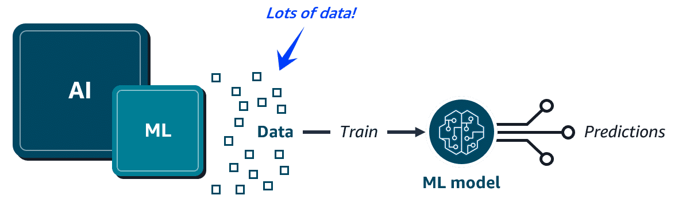

AI
Artificial Intelligence is a broad field focused on the development of intelligent computer systems capable of performing humanlike tasks.

  

ML
Machine learning is a type of AI for training machines to perform complex tasks without explicit instructions. Machine learning training finds the patterns hidden in vast amounts of historical data to produce an ML model. This ML model can then be applied to new data to make predictions or decisions based on the patterns it's learned.

  

Common ML business use cases
ML models power the Amazon.com e-commerce recommendations engine. But, ML can solve for lots of other business use cases, such as the following:

Predict trends, such as future stock prices.

Make decisions, like routing callers to the right department.

Detect anomalies, such as bank fraud.

AWS AI/ML solutions
The AWS AI/ML stack is composed of the following three tiers of solutions:

AI services - pre-built models that are already trained to perform specific functions

ML services - a more customized approach with Amazon SageMaker AI where you build, train, and deploy your own ML models with fully managed infrastructure

ML frameworks and infrastructure - a completely custom approach to building models using purpose-built chips that integrate with popular ML frameworks

---

# 🏥 Doctor–Patient AI Assistant with AWS

### **Step 1: Capture Conversation**

* **Amazon Transcribe**

  * Converts doctor–patient conversation (speech → text).
  * Supports real-time transcription and multiple speakers.

---

### **Step 2: Extract Medical Insights**

* **Amazon Comprehend Medical**

  * Detects **symptoms** (*chest pain, shortness of breath*).
  * Extracts **entities** (*3 weeks, family history*).
  * Identifies **relations** (*father → heart disease*).
  * Outputs structured medical JSON data.

---

### **Step 3: Diagnose / Suggest Problems**

* **Custom ML Model (Amazon SageMaker)**

  * Input: Extracted symptoms + patient history.
  * Uses pre-trained medical dataset or hospital’s data.
  * Predicts possible conditions (e.g., *Angina: 70%, Asthma: 20%*).

---

### **Step 4: Store & Retrieve Patient Data**

* **Amazon DynamoDB / Amazon RDS**

  * Stores patient summaries, history, and AI suggestions.
  * Enables quick retrieval for follow-up visits.

---

### **Step 5: Doctor Dashboard / Patient Report**

* **Amazon QuickSight / Custom Web App**

  * Displays patient history summary.
  * Shows AI-based “suggested problems.”
  * Doctor validates or corrects AI’s suggestions.

---

🔗 **Flow Overview**
🎤 Patient Talk → 🎧 **Amazon Transcribe** → 📄 **Comprehend Medical** → 🤖 **SageMaker ML Model** → 🗄️ **Database** → 📊 **Doctor Dashboard**

