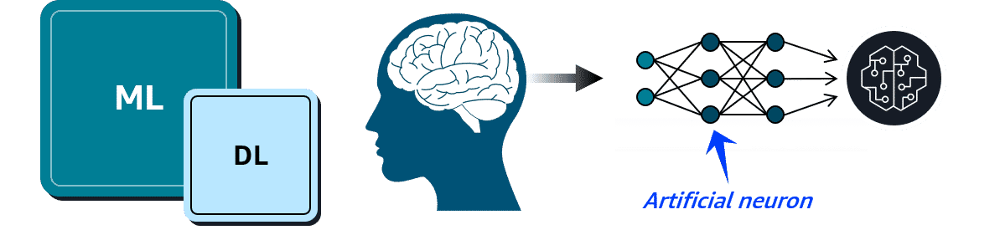
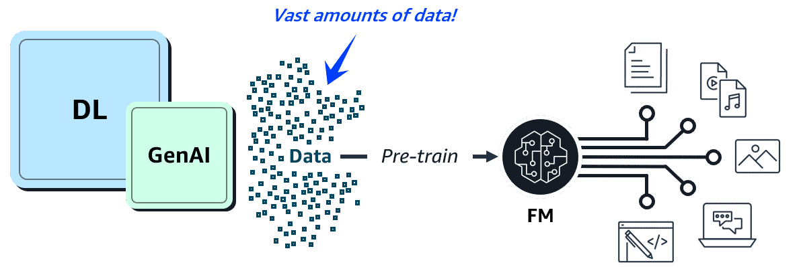

# Deep Learning & Generative AI — Quick Notes

## Deep Learning
Deep learning (DL) is a subset of machine learning where models are trained using layers of artificial neurons that mimic the human brain. Each layer of these neural networks summarizes and feeds information to the next layer until a final model is produced.

  

---

## Generative AI
Generative AI is a type of deep learning powered by extremely large ML models known as **foundation models (FMs)**. FMs are pre-trained on vast collections of data. While traditional ML models are trained to perform singular tasks, FMs can be adapted to perform multiple tasks.

**Large language models (LLMs)** are a popular type of FM trained to use human language. Foundation models can also be used to create videos, images, music, and more.

  

---

## Generative AI on AWS
AWS offers the following types of generative AI solutions:

### Amazon SageMaker JumpStart
An ML hub with FMs and pre-built ML solutions deployable with a few clicks.

### Amazon Bedrock
A fully managed service for adapting and deploying FMs from Amazon and other leading AI companies.

### Amazon Q
An interactive AI assistant that can be integrated with a company's information repositories.
