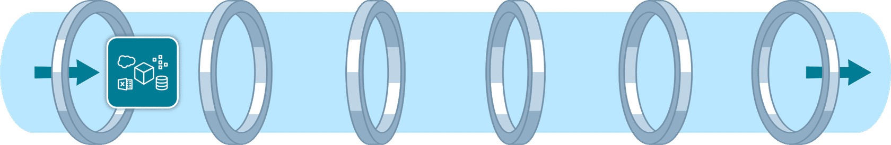
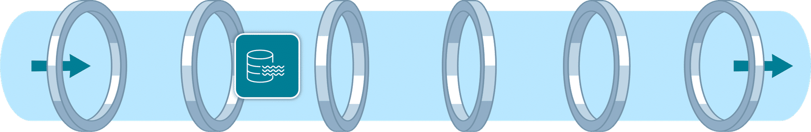
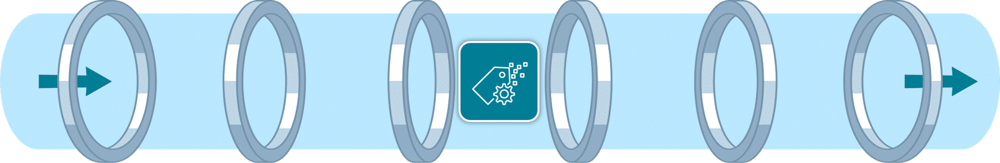
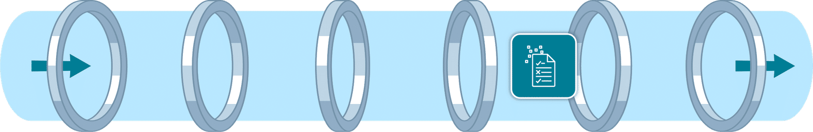
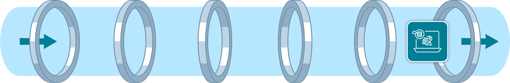

# 📦 AWS Data Pipeline Services

A data pipeline on AWS consists of multiple stages: **data ingestion, storage, cataloging, processing, and visualization/analysis**. Each stage has specific AWS services designed to make data handling efficient, scalable, and cost-effective.

---

## 🔹 Data Ingestion Services

  

**Definition**: Moving data from source systems into your storage solution.

* **Real-time ingestion** → When immediate data availability is required.
* **Batch ingestion** → When some latency is acceptable.

**Services:**

* **Amazon Kinesis Data Streams**

  * Real-time ingestion of terabytes of data (apps, streams, sensors).
  * Serverless, auto-provisioning, and on-demand scaling.
* **Amazon Kinesis Data Firehose**

  * Near real-time ingestion.
  * Fully managed, auto-provisioned, delivers data within seconds.
  * Outputs to data lakes (S3), data warehouses (Redshift), and analytics tools.

---

## 🔹 Data Storage Services

  

**Definition**: Consolidating data into one place to enable insights.

* **Data lakes** → Flexible, vast storage for raw/unstructured data.
* **Data warehouses** → Structured, optimized for analytics and BI.

**Services:**

* **Amazon S3**

  * Object storage for unlimited structured/unstructured data.
  * Fully elastic, secure, and scalable → Common choice for data lakes.
* **Amazon Redshift**

  * Managed data warehouse for petabytes of structured/semi-structured data.
  * Scalable, pay-as-you-go pricing, high-performance analytics.

---

## 🔹 Data Cataloging Services

  

**Definition**: Cataloging with metadata → inventory of organizational data.

**Service:**

* **AWS Glue Data Catalog**

  * Centralized, managed metadata repository.
  * Enhances **data discovery**.
  * Provides metadata to analytics & data stores.
  * Improves **pipeline efficiency**.

---

## 🔹 Data Processing Services

  

**Definition**: Cleaning and transforming data into usable formats.

**Services:**

* **AWS Glue**

  * Fully managed **ETL service**.
  * Simplifies and accelerates data prep.
  * Uses Glue Data Catalog for metadata-driven transformations.
* **Amazon EMR**

  * Best for **large-scale big data processing**.
  * Manages infrastructure, clusters, scaling automatically.
  * Supports frameworks: **Apache Spark, Hadoop, Hive**.

---

## 🔹 Data Analysis & Visualization Services

  

**Definition**: Tools that query, analyze, and visualize processed data for insights.

**Services:**

* **Amazon Athena**

  * Serverless, SQL-based queries.
  * Works across relational, non-relational, object, and custom data sources.
  * Pay-per-query → cost-efficient.
* **Amazon Redshift**

  * Columnar storage, massively parallel architecture.
  * Ideal for complex SQL queries on **large datasets**.
* **Amazon QuickSight**

  * Interactive dashboards & reports without infrastructure management.
  * Supports **Amazon Q in QuickSight** → Natural Language Query (NLQ).
* **Amazon OpenSearch Service**

  * Full-text search & real-time analytics.
  * Supports keyword + natural language queries.
  * Unified dashboards for monitoring logs, metrics, and traces.

---

# 📌 Summary

* **Ingestion** → Kinesis (real-time), Firehose (near real-time).
* **Storage** → S3 (data lake), Redshift (data warehouse).
* **Cataloging** → Glue Data Catalog.
* **Processing** → Glue (ETL), EMR (big data frameworks).
* **Analysis & Visualization** → Athena, Redshift, QuickSight, OpenSearch.

---

✅ This is now a **complete, structured study/reference note** in Markdown with inline HTML for image rendering.

# AWS Services Overview

| Service             | Category            | Use Case                                                                 |
|---------------------|--------------------|--------------------------------------------------------------------------|
| **EC2**             | Compute            | Launch and manage virtual servers for applications.                      |
| **VPC**             | Networking         | Isolate and secure resources within a custom virtual network.            |
| **Subnets**         | Networking         | Divide VPC into smaller networks for resource organization.              |
| **Lambda**          | Compute (Serverless)| Run code without managing servers; pay per execution.                    |
| **RDS**             | Database           | Managed relational database (e.g., MySQL, PostgreSQL, SQL Server).       |
| **S3**              | Storage            | Store and retrieve any type of data (files, backups, static hosting).    |
| **CloudFormation**  | Infrastructure as Code | Automate resource provisioning using templates.                          |
| **Elastic Beanstalk** | Application Management | Deploy and scale applications automatically with minimal setup.         |
| **IAM**             | Security & Access  | Manage user permissions and secure AWS access.                           |
| **SNS**             | Messaging (Pub/Sub)| Send notifications/messages to multiple subscribers.                     |
| **SQS**             | Messaging (Queue)  | Decouple applications using message queuing.                             |
| **MSK (Kafka)**     | Messaging (Streaming)| Event streaming and pub/sub for microservices.                          |
| **Polly**           | AI/ML (Text-to-Speech) | Convert text into natural-sounding speech.                              |
| **Comprehend**      | AI/ML (NLP)        | Analyze and extract insights from text (sentiment, entities, key phrases).|

