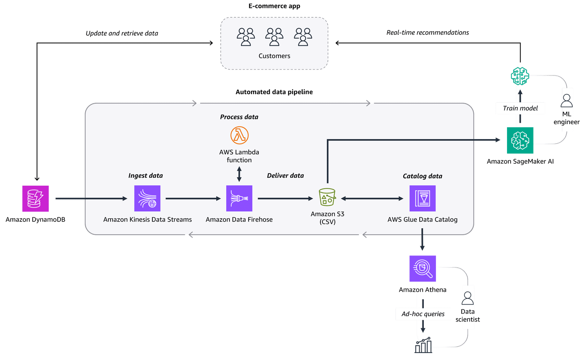

Data analytics and AI/ML architecture diagram

Delivering customer data for analysis and ML model training

Let's review the solution discussed in the video. An e-commerce company uses an automated data pipeline to ingest, process, and deliver data to multiple stakeholders. As a result, data scientists and ML engineers can use the same data set for analysis and ML model training.

To review the steps that make up the solution, choose each of the eight numbered markers.

 

---

# Explanation of Each Step in the Diagram

### **1. Customers interact with the e-commerce app**

* Customers are using the app (browsing, purchasing, reviewing, etc.).
* Their interactions generate **transactional and behavioral data**.
* This data is used later for **real-time recommendations** and analytics.

---

### **2. Amazon DynamoDB (Transactional Data Storage)**

* Customer data is updated and retrieved in **Amazon DynamoDB**, a NoSQL database.
* DynamoDB captures customer transactions (like orders, clicks, preferences).
* It provides **fast and scalable storage** for operational data.

---

### **3. Ingest Data (Amazon Kinesis Data Streams + Firehose)**

* **Amazon Kinesis Data Streams** ingests large volumes of real-time data from the app.
* Then, **Amazon Kinesis Data Firehose** delivers this streaming data to storage/processing destinations (like S3).
* This makes data **ready for further transformation**.

---

### **4. Process Data (AWS Lambda)**

* **AWS Lambda function** processes the raw data in real time.
* Example: cleaning, filtering, or transforming records before storage.
* This is **serverless**, so it scales automatically without infrastructure management.

---

### **5. Deliver Data (Amazon S3)**

* The processed data is stored in **Amazon S3** (in CSV format).
* S3 acts as the **data lake**, storing large volumes of structured/unstructured data.
* From here, the data can be shared across teams for analysis and ML.

---

### **6. Catalog Data (AWS Glue Data Catalog)**

* **AWS Glue Data Catalog** creates a metadata repository for the data in S3.
* This allows tools like **Athena** or **SageMaker** to discover and query the data efficiently.
* Essentially, it makes data **searchable and organized**.

---

### **7. Ad-hoc Queries (Amazon Athena)**

* **Amazon Athena** is used by data scientists to run SQL queries directly on the data in S3.
* This enables **ad-hoc analysis** without moving the data into another database.
* Example: identifying customer behavior trends.

---

### **8. Train ML Models (Amazon SageMaker AI)**

* The same data is fed into **Amazon SageMaker AI**, where ML engineers build and train ML models.
* Example: real-time recommendation models, fraud detection models, or customer churn prediction.
* Models are then deployed back into the **e-commerce app** to improve customer experience (recommendations).

---

✅ **Summary**:

* **Steps 1–5:** Capture and store raw customer data.
* **Steps 6–7:** Organize and analyze data for insights.
* **Step 8:** Use the same data to train ML models and provide **real-time recommendations**.

---

# AWS Services Overview — AI/ML & Data Pipelines

| Service                          | Category                     | Use Case                                                                 |
|----------------------------------|------------------------------|--------------------------------------------------------------------------|
| **Amazon Kinesis Data Streams**  | Ingestion (Real-time)        | Real-time ingestion of streaming data from apps, sensors, etc.          |
| **Amazon Kinesis Data Firehose** | Ingestion (Near real-time)   | Auto-delivers streaming data to S3, Redshift, or analytics tools.        |
| **AWS Lambda**                   | Processing (Serverless)      | Serverless data transformation or enrichment during ingestion.           |
| **Amazon S3**                    | Storage (Data Lake)          | Centralized storage for structured & unstructured data.                  |
| **Amazon Redshift**              | Storage / Analytics          | Scalable data warehouse for querying large structured datasets.           |
| **AWS Glue Data Catalog**        | Cataloging Metadata          | Central metadata repository enabling data discovery across tools.         |
| **AWS Glue**                     | Processing (ETL)             | Fully managed ETL to clean, transform, and prepare data for analysis.     |
| **Amazon EMR**                   | Processing (Big Data)        | Big data processing with Spark, Hadoop, Hive for large datasets.          |
| **Amazon Athena**                | Analysis (Serverless SQL)    | Run ad-hoc SQL queries directly on S3 data, pay per query.                |
| **Amazon QuickSight**            | Visualization & BI           | Create dashboards and reports; includes Natural Language Query capability.|
| **Amazon OpenSearch Service**    | Analysis (Search & Dashboards)| Search, real-time log analysis, and dashboards for operational insights.  |
| **Amazon SageMaker AI**          | AI/ML Model Training         | Train and deploy machine learning models using data from the pipeline.    |

---

# AWS AI/ML Services (Not Directly in Data Pipelines)

| **Service**                  | **Category**            | **Use Case**                                                              |
| ---------------------------- | ----------------------- | ------------------------------------------------------------------------- |
| **Amazon SageMaker**         | ML Platform             | Build, train, and deploy custom ML models at scale.                       |
| **Amazon Comprehend**        | NLP (Text Analysis)     | Sentiment analysis, entity recognition, key phrase extraction.            |
| **Amazon Lex**               | Conversational AI       | Create chatbots and voicebots with natural language understanding.        |
| **Amazon Polly**             | Speech (TTS)            | Convert text to lifelike speech in multiple languages/voices.             |
| **Amazon Rekognition**       | Computer Vision         | Detect objects, faces, unsafe content in images/videos.                   |
| **Amazon Transcribe**        | Speech (STT)            | Convert audio/speech into text (transcription).                           |
| **Amazon Translate**         | Translation             | Real-time translation between languages.                                  |
| **Amazon Textract**          | OCR (Document AI)       | Extract text, tables, forms from scanned PDFs/images.                     |
| **Amazon Personalize**       | Recommendation Engine   | Personalized product/content recommendations (like Amazon/Netflix).       |
| **Amazon Forecast**          | Time-series Forecasting | Predict future trends (sales, demand, finance, etc.).                     |
| **Amazon Kendra**            | Intelligent Search      | Contextual enterprise search with ML-powered ranking.                     |
| **Amazon Bedrock**           | Generative AI Platform  | Serverless access to LLMs & diffusion models via API.                     |
| **Amazon Titan Models**      | Foundation Models       | Amazon’s proprietary LLMs for text and embeddings (via Bedrock).          |
| **Anthropic Claude / LLaMA** | Foundation Models       | Partner LLMs accessible through Bedrock (chat, reasoning, summarization). |
| **Amazon CodeWhisperer**     | AI for Developers       | AI coding assistant for code generation and suggestions.                  |
| **AWS HealthScribe**         | Healthcare AI           | Transcribes doctor-patient conversations, generates clinical summaries.   |
