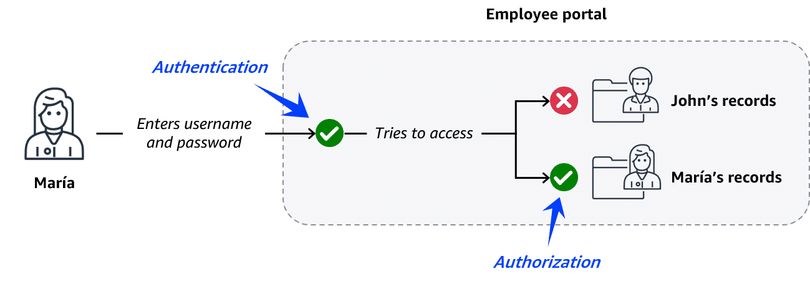
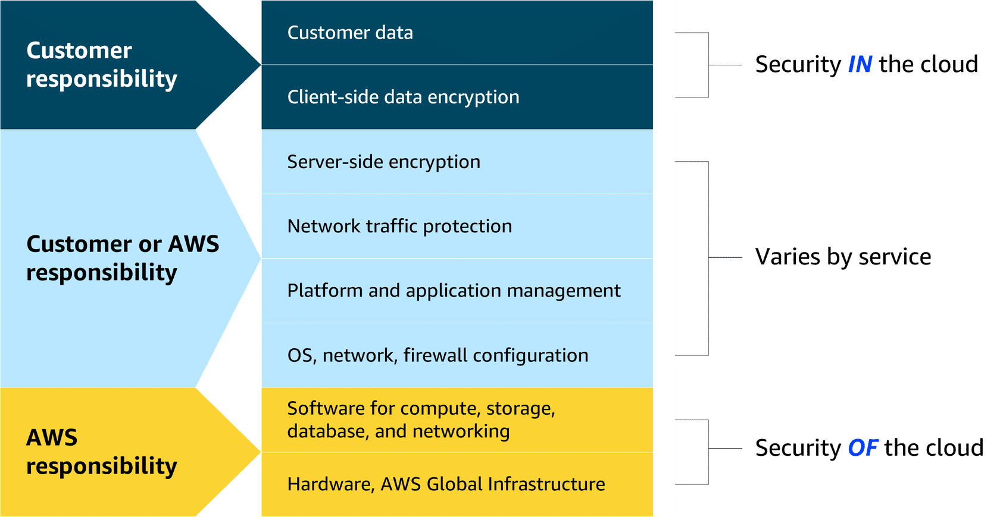

---

# 🔐 Introduction to AWS Security

Security in AWS is similar to securing a coffee shop — everyone has a role to play!
Two core principles to start with are **Authentication** and **Authorization**, followed by the **AWS Shared Responsibility Model** and **Security Controls**.

---

## 1. Authentication & Authorization

* **Authentication** → Verifies the identity of a user or entity.
  ✅ Example: An employee logs into the company portal using username + password.

* **Authorization** → Grants permissions and access rights, deciding *what* the authenticated user can do.
  ✅ Example: An employee can only view their own employee records.

🔑 Together, they ensure **data privacy, protection, and prevent misuse**.

---

## 2. AWS Shared Responsibility Model

Security in AWS follows the **Shared Responsibility Model**, which defines the split of duties between **AWS** and the **customer**.

### Customer Responsibilities — *Security in the Cloud*

You control everything you build and run inside AWS:

* Managing the security of your **data, applications, and systems**
* Deciding **what workloads** to run in AWS
* Choosing **which AWS services** to use
* Controlling **who has access** to resources

### AWS Responsibilities — *Security of the Cloud*

AWS ensures the security of its infrastructure:

* Foundational **software** that powers AWS services
* **Virtualization layer** and compute management
* **Hardware and global infrastructure**: Regions, Availability Zones, edge locations

---

## 3. AWS Security Controls

AWS provides multiple mechanisms to help customers strengthen security across their environments:

* **Prevention** → Proper permission and access management
* **Protection** → Safeguard networks, applications, and data
* **Detection & Response** → Monitor, detect, and respond to incidents in real-time

