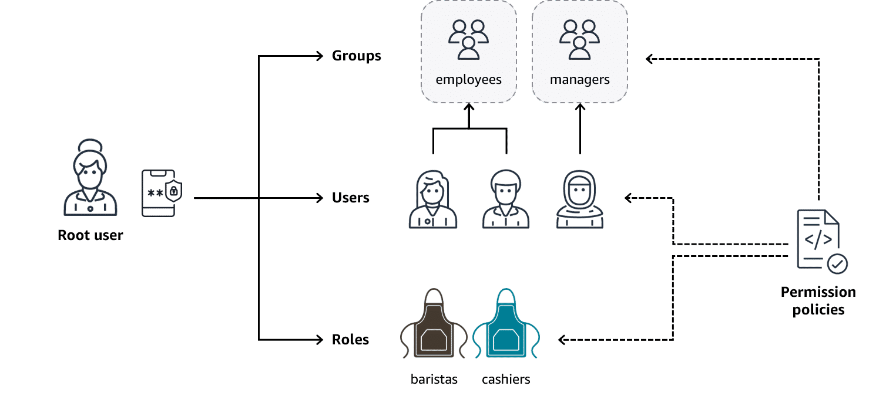

# 🛡️ AWS Identity and Access Management (IAM)

**IAM** enables you to securely manage **identities** and **access** to AWS resources.
By default, **all actions are denied** — you must explicitly grant permission.

🔑 **Principle of Least Privilege**
Grant only the permissions needed, and nothing more.

---

## 1. IAM Identities

<div style="background:#fff; padding:8px; display:inline-block; border-radius:6px;">

</div>

IAM provides **identities** that can be managed and controlled with **policies**:

* **Root User**

  * Created when the AWS account is first made.
  * Has *full permissions* for everything in the account.
  * Must be secured with **MFA**.
  * ❌ Not recommended for daily tasks.

* **IAM Users**

  * Represent individual people or applications.
  * By default → **0 permissions**.
  * Must be explicitly assigned permissions.

* **IAM Groups**

  * Collections of users.
  * Policies attached to groups apply to all members.

* **IAM Roles**

  * Temporary access identities with policies.
  * No static credentials.
  * Used for cross-account access, AWS services, or federated users.

---

## 2. IAM Policies

Policies are **JSON documents** that define **allow/deny rules** for actions on resources.

### Example: Grant permission to list objects in an S3 bucket

```json
{
  "Version": "2012-10-17",
  "Statement": [
    {
      "Effect": "Allow",
      "Action": "s3:ListBucket",
      "Resource": "arn:aws:s3:::coffee_shop_reports"
    }
  ]
}
```

* **Effect** → Allow / Deny
* **Action** → API calls (e.g., `s3:ListBucket`)
* **Resource** → ARN of the AWS resource

---

## 3. Key Concepts in Permissions

* **Root User** → Full, unrestricted access.
* **Users** → Identities for people/apps (must be granted permissions).
* **Groups** → Manage multiple users with shared permissions.
* **Policies** → JSON documents controlling actions.
* **Roles** → Temporary credentials for trusted access.
* **IAM Identity Center (SSO)** → Federate external users into AWS with single sign-on.

---

## 4. Best Practices

* Enable **MFA** on the root account.
* Avoid using the **root user** for daily work.
* Follow **principle of least privilege**.
* Use **roles** instead of long-term access keys.
* Apply **policies** at the group/role level for scalability.

---

✅ With IAM, AWS provides **authentication + authorization controls** that prevent security incidents before they happen.


---

# 🔐 Additional AWS Access Management Services

These services support **principle of least privilege** and secure access management.

---

## 1. AWS IAM Identity Center


* Centralizes **identity and access management** across **AWS accounts & apps**.
* Supports **single sign-on (SSO)** for workforce users.
* Integrates with external identity providers (e.g., Okta, Active Directory).
* Based on **federated identity management** → use one set of credentials across apps.

**Use Case**: Employees log into AWS services with their corporate credentials.

---

## 2. AWS Secrets Manager

* Securely manages **secrets** such as:

  * Database credentials
  * API keys
  * Passwords
* Supports **automatic rotation** of secrets.
* Provides programmatic retrieval via API (no hardcoding in apps).

**Use Case**: Rotate DB passwords every 30 days without manual updates in code.

---

## 3. AWS Systems Manager


* Provides **centralized operations management** for AWS, on-premises, and multi-cloud.
* Can manage **nodes** (servers/VMs/instances).
* Automates:

  * Security patching
  * User management
  * Registry edits
* Improves visibility with inventory of all nodes (OS, IDs, configs).

**Use Case**: Patch all EC2 instances in multiple regions with a single command.

---

# 📊 Quick Comparison Table

| Service                 | Purpose                              | Key Feature                            | Example Use Case                           |
| ----------------------- | ------------------------------------ | -------------------------------------- | ------------------------------------------ |
| **IAM Identity Center** | Centralized identity & SSO           | Federated identity management          | Workforce login with corporate credentials |
| **Secrets Manager**     | Manage and rotate secrets securely   | Auto rotation + API retrieval          | Rotate DB credentials securely             |
| **Systems Manager**     | Centralized node & config management | Patch mgmt, automation, hybrid support | Patch EC2 fleet in multiple regions        |

