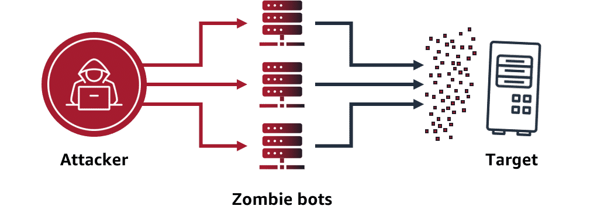

# 🌐 Network & Application Attacks in AWS

## 🚨 Types of Attacks

| Attack Type                 | How it Works                                                                     | Example                                  |
| --------------------------- | -------------------------------------------------------------------------------- | ---------------------------------------- |
| **DoS (Denial of Service)** | Single attacker floods your app with traffic → overloads it → legit users denied | One computer sending massive requests    |
| **DDoS (Distributed DoS)**  | Multiple infected computers (**zombie bots**) send traffic → harder to block     | Botnet sending fake requests to your app |

📌 Example: **UDP flood attack** — attacker fakes your IP as the return address, making a legit service (like weather API) flood **your servers** with data.

---

---

## 🛡 AWS Protection Through Infrastructure

| AWS Infra Component              | Role in Protection                                                                                           |
| -------------------------------- | ------------------------------------------------------------------------------------------------------------ |
| **Security Groups**              | Work at AWS network level → allow only valid request protocols, block brute-force floods (e.g., UDP floods). |
| **Elastic Load Balancing (ELB)** | Fronts your app → absorbs & distributes traffic before reaching backend.                                     |
| **AWS Regions**                  | Enormous capacity across AZs & edge locations → very hard to overwhelm.                                      |

---

## 🔧 AWS Protection Through Services

| Service                                | Category                        | Key Features                                                                    | Use Case                              |
| -------------------------------------- | ------------------------------- | ------------------------------------------------------------------------------- | ------------------------------------- |
| **AWS Shield (Standard)**              | DDoS protection (default, free) | Auto mitigation of common DDoS attacks, built-in with ELB, CloudFront, Route 53 | Protect websites automatically        |
| **AWS Shield (Advanced)**              | Premium DDoS protection         | Attack diagnostics, integrates with WAF, protects against sophisticated DDoS    | Large-scale enterprise defense        |
| **AWS WAF (Web Application Firewall)** | Application-layer security      | Blocks malicious traffic using Web ACLs (IP-based, patterns, ML detection)      | Block SQL injection, XSS, bot traffic |

---

# 📊 Quick Defense Strategy in AWS

1. **Security Groups** → Only allow required protocols/ports.
2. **ELB + CloudFront + Route 53** → Distribute & absorb traffic at scale.
3. **AWS Shield Standard** → Always-on baseline protection (free).
4. **AWS WAF** → Block known bad IPs & malicious request patterns.
5. **AWS Shield Advanced** → Add diagnostics & advanced attack mitigation.

---

⚡ This builds a **multi-layer defense model**:
Infra (scale) ➝ Shield ➝ WAF ➝ Advanced services

