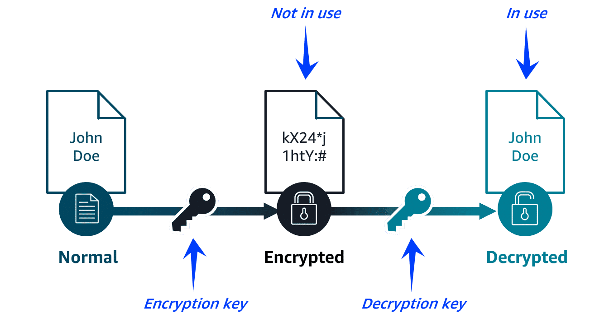
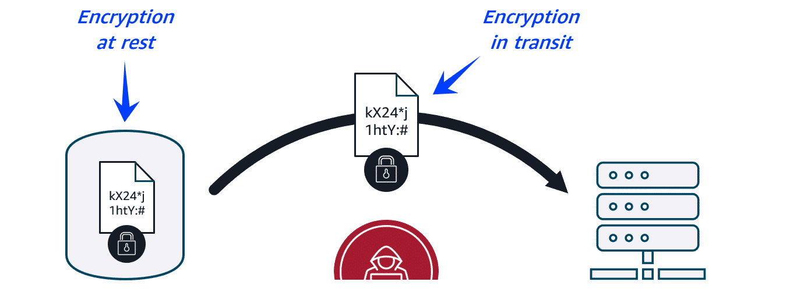

# 🔐 Data Encryption —

Encryption protects data by turning it into unreadable ciphertext unless you have the right key. Below are structured notes, embedded HTML images (so they render where HTML is allowed), AWS services for encryption, and **concise one-liners for advanced terms** like SSL/TLS.

---

## 🔁 Encryption basics

  

* **What it is:** Encryption is a lock-and-key mechanism: plaintext → *encrypt with key* → ciphertext. Only someone with the correct key can decrypt back into readable plaintext.
* **Why it matters:** Protects confidentiality of customer profiles, payment data, and any sensitive information stored or transmitted.

---

## 🔒 Types of encryption

### Encryption **at rest**

* Data stored on disk (S3, EBS, Redshift, DynamoDB) is encrypted so stolen or copied storage media cannot reveal plaintext.

### Encryption **in transit**

* Data moving across networks is encrypted (via TLS/SSL) to prevent eavesdropping or tampering while being sent between services or clients.

  

---

## 🛠 AWS Data Protection — Services & Roles

| Service                           |                 Category | Purpose                                                                                   |
| --------------------------------- | -----------------------: | ----------------------------------------------------------------------------------------- |
| **AWS KMS**                       |           Key management | Create, store and control cryptographic keys (CMKs) used across AWS services.             |
| **Amazon Macie**                  |     Data discovery & DLP | Uses ML to find and alert on sensitive data in S3 (PII, credentials).                     |
| **AWS Certificate Manager (ACM)** |   Certificates (TLS/SSL) | Provision, manage, and renew TLS/SSL certificates for HTTPS and other encrypted channels. |
| **S3 (built-in encryption)**      |       Storage protection | Objects encrypted by default (SSE-S3, SSE-KMS, SSE-C options).                            |
| **EBS (encryption)**              | Block storage protection | EBS volumes and snapshots encrypt data at rest.                                           |
| **DynamoDB (encryption)**         |            DB protection | Server-side encryption using AWS KMS for table data.                                      |

---

## ✅ Best practices (quick)

* Enable encryption **at rest** for all storage (S3, EBS, RDS, DynamoDB).
* Use **TLS** for all connections (HTTPS, database connections, service-to-service).
* **Rotate keys** periodically and use automatic rotation for KMS CMKs where possible.
* Use **least-privilege** for KMS key policies and IAM roles that can use keys.
* Consider **envelope encryption** (data key encrypts data; CMK encrypts data key) for efficiency.
* Monitor sensitive data with **Amazon Macie** and enforce policies.

---

## 🔎 Advanced terms — concise one-liners (study-ready)

* **SSL (Secure Sockets Layer)** — Legacy protocol that encrypts network traffic; largely replaced by TLS.
* **TLS (Transport Layer Security)** — Modern protocol for encrypting network traffic (HTTPS uses TLS).
* **HTTPS** — HTTP over TLS; shows a padlock in browsers and secures web traffic.
* **Symmetric encryption** — Single shared secret key used for both encrypting and decrypting (fast; e.g., AES).
* **Asymmetric encryption (public-key)** — Uses key pair (public/private); public key encrypts, private key decrypts (e.g., RSA, ECC).
* **Cryptographic key** — A random string used by algorithms to encrypt or decrypt data.
* **Customer Master Key (CMK)** — Primary key in AWS KMS used to encrypt/decrypt data keys or to sign and verify.
* **Data key** — Short-lived symmetric key used to encrypt data; often itself encrypted by a CMK (envelope encryption).
* **Envelope encryption** — Pattern where data is encrypted with a data key, and the data key is encrypted with a master key (efficient + secure).
* **KMS (Key Management Service)** — Managed AWS service to create, rotate, disable, and control access to keys; keys never leave KMS.
* **HSM (Hardware Security Module)** — Secure hardware appliance for generating and protecting keys; used behind the scenes by managed KMS or in BYOM (CloudHSM).
* **Key rotation** — Periodic replacement/renewal of keys to limit exposure if a key is compromised.
* **Key policy** — A KMS policy that specifies who can manage/use a CMK — primary control in KMS.
* **Key alias** — Friendly name for a KMS key (e.g., `alias/my-app-key`) to avoid using ARNs everywhere.
* **Certificate** — Digital document binding a public key to an identity, issued by a Certificate Authority (CA).
* **PKI (Public Key Infrastructure)** — System of CAs, registration, certificates and revocation lists that supports certificate issuance and validation.
* **TLS handshake** — Initial protocol steps where client and server agree on versions, ciphers, and exchange keys to establish a secure session.
* **Mutual TLS (mTLS)** — Both client and server present certificates to mutually authenticate.
* **Perfect Forward Secrecy (PFS)** — Property where compromise of long-term keys does not compromise past session keys (e.g., using ephemeral Diffie-Hellman).
* **Cipher** — The algorithm that performs encryption/decryption (e.g., AES-256-GCM).
* **Initialization Vector (IV)** — Non-secret random value used with symmetric ciphers to produce unique ciphertexts for identical plaintexts.
* **Nonce** — Number used once to ensure freshness in cryptographic protocols (prevents replay).
* **MAC (Message Authentication Code)** — Short tag proving message integrity and authenticity (e.g., HMAC).
* **Hashing** — One-way transformation producing a fixed-size digest (e.g., SHA-256) for integrity checks.
* **SHA-256** — A widely used cryptographic hash algorithm producing a 256-bit digest.
* **SSE-S3** — S3 Server-Side Encryption using S3 managed keys (SSE-S3).
* **SSE-KMS** — S3 Server-Side Encryption using AWS KMS keys (gives you key control & audit).
* **SSE-C** — Server-side encryption with customer-provided keys (customer supplies keys each request).
* **Client-side encryption** — Data encrypted by the client before sending to storage; cloud stores only ciphertext.
* **Server-side encryption** — Cloud service encrypts data after it is received and stores ciphertext.
* **Certificate revocation** — Process of invalidating a certificate before expiry (CRL or OCSP).
* **ACM (AWS Certificate Manager)** — Provision, manage, and auto-renew TLS certificates for AWS services.
* **MAC verification** — Ensures data hasn't been tampered with by checking the MAC/tag after decryption.
* **Data discovery / DLP** — Identifying and protecting sensitive data (e.g., Amazon Macie for S3).
* **Replay attack** — Attack where valid data transmission is maliciously repeated or delayed; nonces and timestamps mitigate this.
* **Transport Layer Security versions** — TLS 1.2 and 1.3 are current; avoid older insecure versions.

---

## 🔁 How these pieces fit in an AWS architecture (concise flow)

1. **Generate data key (KMS)** → 2. **Encrypt data with data key (client/server)** → 3. **Encrypt data key with CMK (KMS)** → 4. **Store ciphertext in S3/EBS/DynamoDB** → 5. **Use TLS (ACM) to encrypt traffic in transit** → 6. **Monitor sensitive data (Macie)** → 7. **Rotate keys & audit access (KMS + CloudTrail)**

---

## ✅ Example: Protecting a user phone number

* **At rest:** Phone number stored in S3 encrypted with SSE-KMS (KMS CMK protects data key).
* **In transit:** Application requests phone number over HTTPS (TLS provided via ACM-managed certificate).
* **Access control:** IAM policy restricts which roles/users can call `kms:Decrypt` for that CMK.
* **Monitoring:** Macie scans S3 and alerts if that PII is exposed.

---