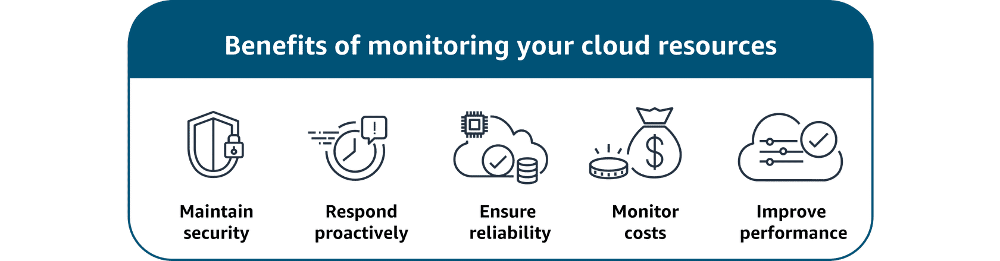

# 🛡️ Governance & Compliance Progression in AWS

To manage resources securely and responsibly in the AWS Cloud, organizations typically follow this **four-step progression**:

---

### 1. **Secure 🔒**

* **Goal:** Protect data, systems, and infrastructure.
* **Focus Areas:**

  * Firewalls
  * Authentication & access control
  * Identity & access management (IAM)
  * Encryption & vaults
* ✅ Ensures only the right people and systems have access.

---

### 2. **Monitor 🔍**

* **Goal:** Continuously observe and analyze activity.
* **Focus Areas:**

  * System & application logs
  * Network traffic analysis
  * Security event monitoring
* ✅ Detects threats, anomalies, and unusual behavior in real-time.

---

### 3. **Audit 📋**

* **Goal:** Review and assess security practices.
* **Focus Areas:**

  * Periodic checks of security controls
  * Verifying adherence to policies
  * Ensuring requirements are met
* ✅ Confirms that protections are working as intended.

---

### 4. **Compliance 📜**

* **Goal:** Align with laws, regulations, and standards.
* **Focus Areas:**

  * GDPR, HIPAA, PCI DSS, ISO, SOC, etc.
  * Internal company policies & contractual obligations
* ✅ Demonstrates trustworthiness and avoids legal/financial risks.

---

📌 **In short:**

* **Secure** → Build protection
* **Monitor** → Watch for issues
* **Audit** → Check effectiveness
* **Compliance** → Prove alignment with rules

Got it ✅
Here’s a clean **Markdown version** of your “Importance of Monitoring” content with the image reference:

---

# 📡 Importance of Monitoring in AWS

Monitoring your cloud resources is essential because it allows you to:

* Continuously **observe and analyze** system activity
* Track **network traffic** and **security events**
* Detect **potential threats** or **anomalies** early

Monitoring and observability are critical for ensuring:

* 🔒 **Security**
* ⚡ **Availability**
* 🔁 **Reliability**
* 🚀 **Performance**

---

### 🏆 Benefits of Monitoring

* **Enhanced Security:** Identify suspicious activity before it becomes a breach
* **Operational Efficiency:** Save time with automated monitoring and alerts
* **Performance Optimization:** Ensure workloads and data run smoothly

  

📊 Monitoring is performed using:

* Real-time monitoring tools
* Log collection & analysis
* Dashboards for visualization

