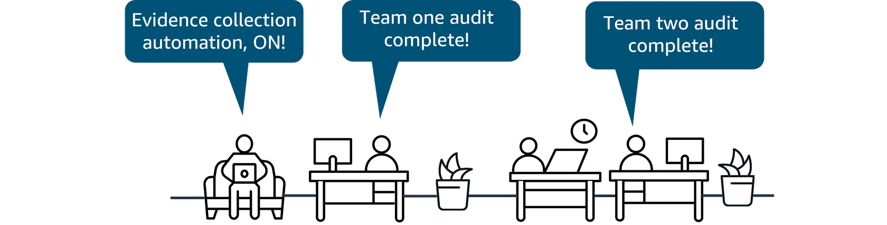

## **AWS Config**

* **What it is**: A service that **tracks and evaluates the configurations** of AWS resources.
* **Benefits**:

  * Evaluate configurations against compliance rules
  * Track and manage resource configuration changes
  * Troubleshoot misconfigurations and automate remediation
* **Use cases**:

  * Continuous auditing of security & compliance
  * Change management tracking
  * Operational troubleshooting

👉 **Stage Mapping**: Fits under **Audit 📋** (because it continuously checks resource compliance & configurations).

  

---

## **AWS Audit Manager**

* **What it is**: A service that **automates audit evidence collection** for compliance frameworks.
* **Benefits**:

  * Automated evidence gathering
  * Streamlines collaboration across security, audit, and compliance teams
  * Maintains audit integrity with read-only evidence collection
* **Use cases**:

  * Continuous compliance assessment
  * Internal risk assessments
  * Proving compliance to regulators or auditors

👉 **Stage Mapping**: Fits under **Compliance 🏛️** (because it automates compliance assessments and reporting).

  

---

## Quick notes
- **AWS Config** helps you *assess, audit, and evaluate* configurations (great for continuous compliance checks and automated remediation).  
- **AWS Audit Manager** automates evidence collection, reducing manual audit work and helping prove compliance.

