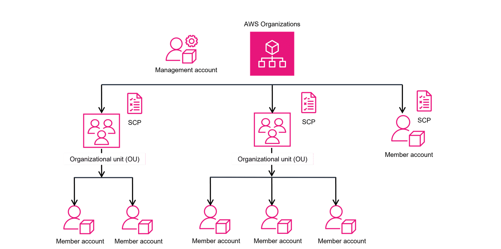

# AWS Organizations

AWS **Organizations** helps you centrally manage and govern your environment as you grow and scale AWS resources.  
It allows you to **manage policies**, automate **account creation**, and consolidate billing across accounts.

---

## Benefits
- Scale your environment by programmatically creating new AWS accounts.
- Simplify permission management using **Service Control Policies (SCPs)**.
- Optimize and manage costs across multiple accounts.
- Share common resources across accounts.
- Provide tools and access for security teams in a structured way.

---

## Key Concepts

  

- **Organization**  
  A collection of AWS accounts that you manage centrally.  
  Organized into a tree-like hierarchy with a **Root** at the top.  

- **Root**  
  The top-level parent container for all AWS accounts in the Organization.  
  Every Organization has exactly one Root.

- **Management Account**  
  The central AWS account that creates and manages the Organization.  
  Has control over policies, account creation, and consolidated billing.  

- **Organizational Unit (OU)**  
  A logical grouping of accounts.  
  OUs can contain **member accounts** or even **nested OUs**, allowing flexible hierarchies.

- **Service Control Policies (SCPs)**  
  Restrict which **AWS services, resources, and API actions** users and roles can access.  
  Can be applied to **OUs** or **individual accounts** for fine-grained governance.  

- **Member Account not in an OU**  
  Accounts can exist directly under the Root without being part of an OU.  
  They still benefit from consolidated billing and other Org features.

