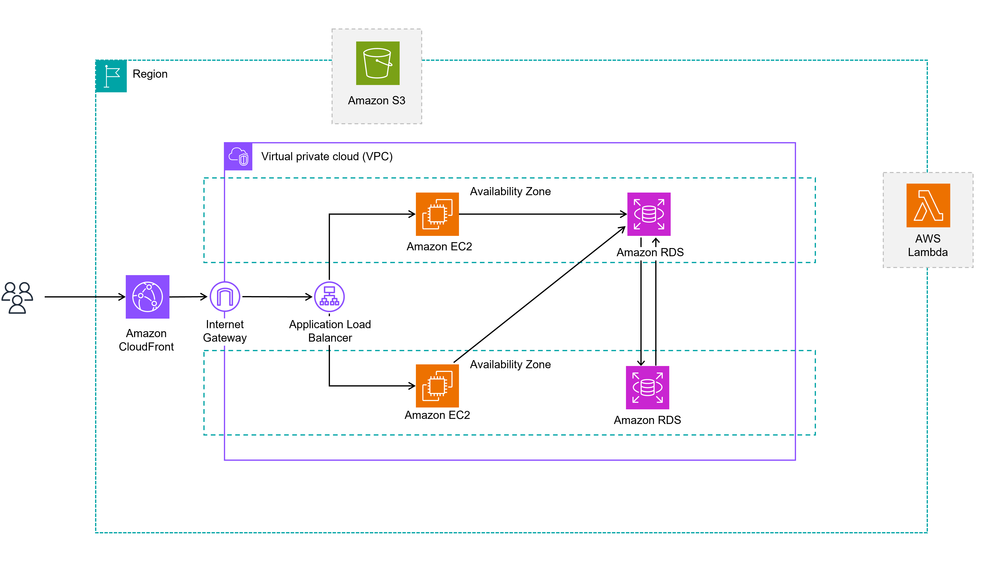
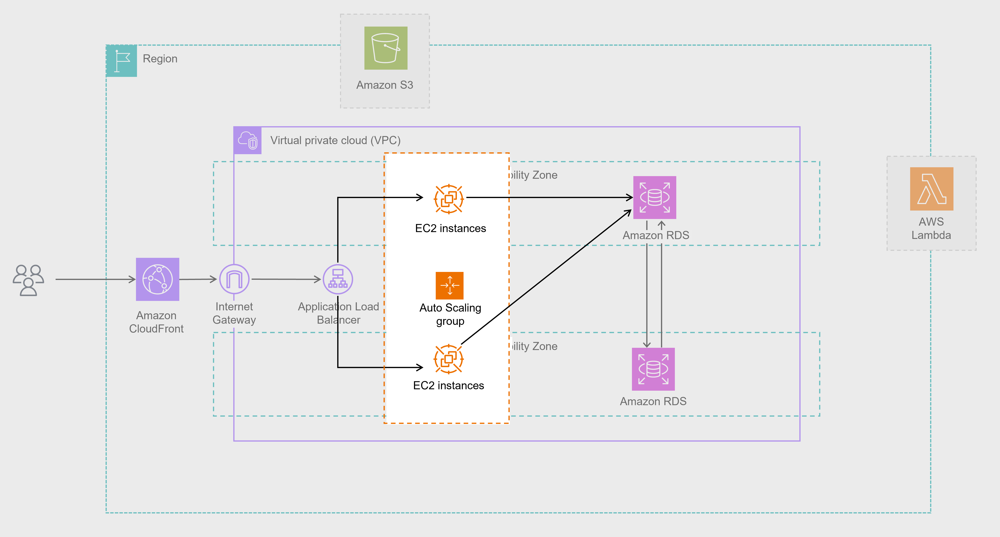
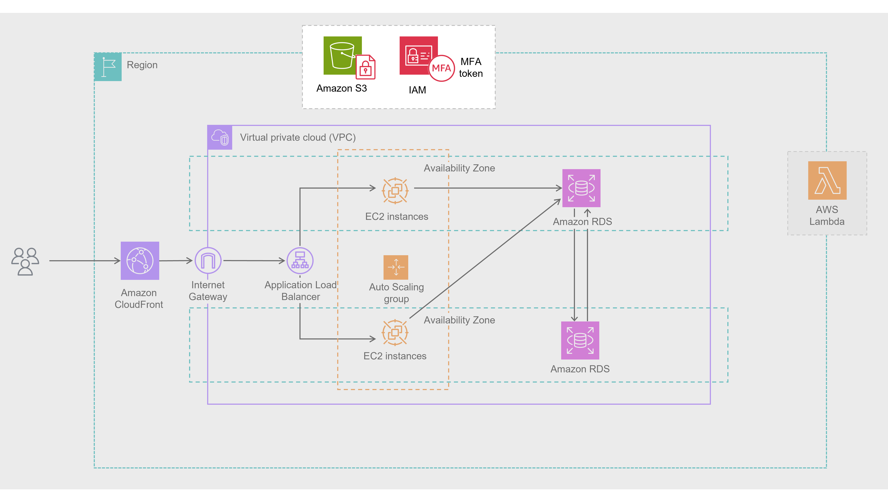
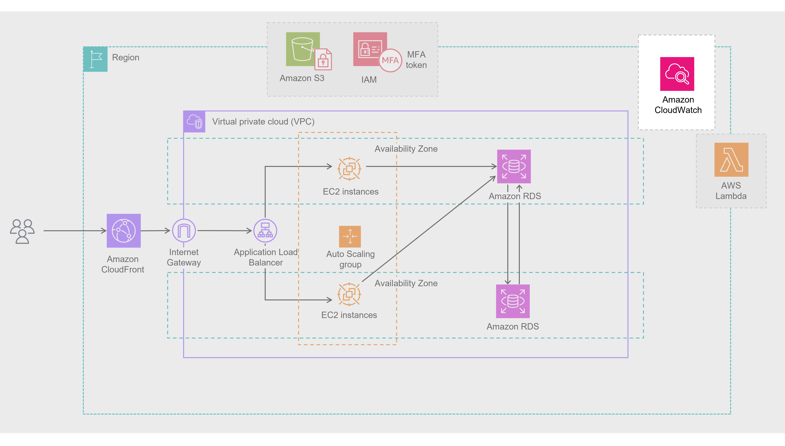
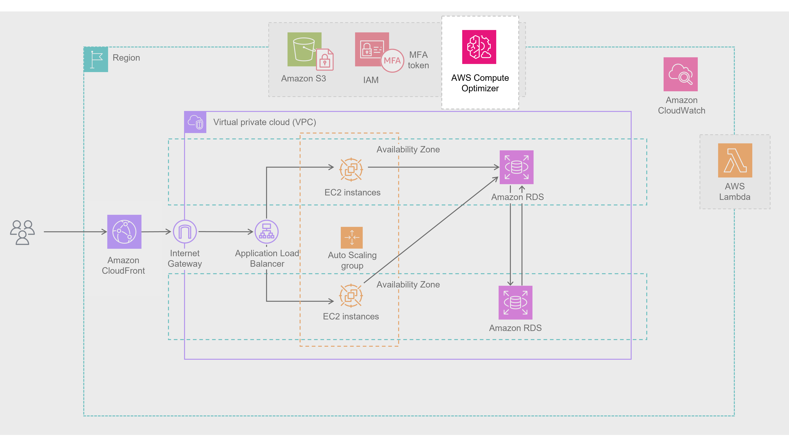
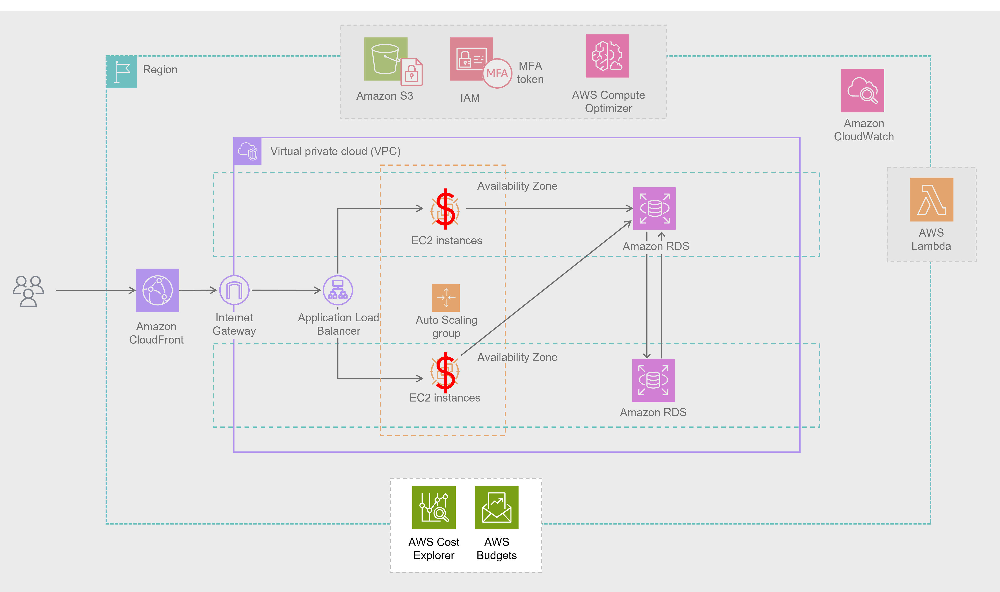
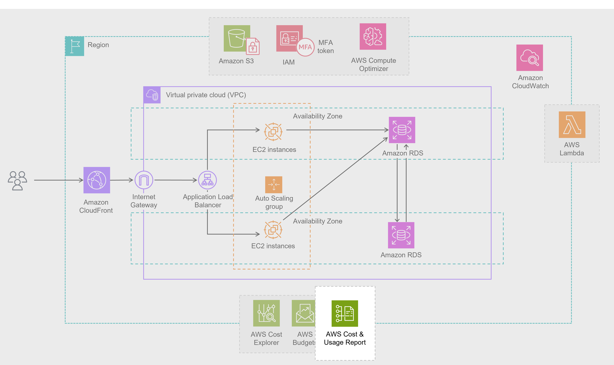
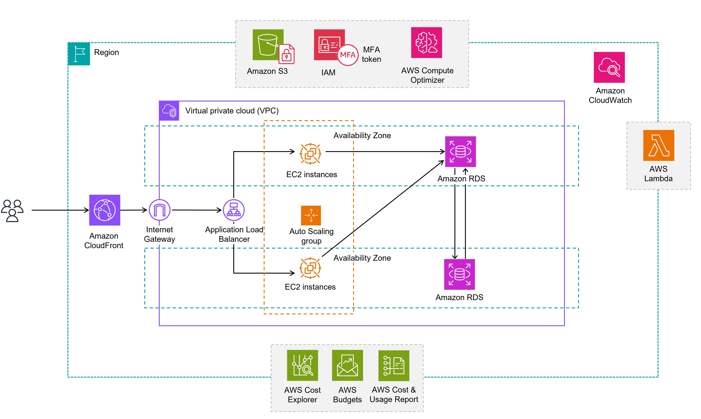

---
Starting architecture
Automate scaling with EC2 Auto Scaling and use self-healing tools to stay resilient and efficient under demand.

  

Let’s look at your current setup. You have a classic ecommerce architecture. It includes Amazon Elastic Compute Cloud (Amazon EC2) instances for the website and Amazon Relational Database Service (Amazon RDS) databases to handle orders and customer data. It also has an Amazon Simple Storage Service (Amazon S3) bucket full of product images. It’s functional, but let's evaluate how well it's scaling and handling traffic—especially during busy times.

---
Operational Excellence
Ensure resilience with EC2 Auto Scaling, infrastructure as code, and self-healing tools for reliable, efficient operations.

  

Your business is running smoothly, but what happens if an EC2 instance crashes during a rush of orders? To be truly resilient, you can automate scaling with EC2 Auto Scaling. Additionally, to make day to day operations more reliable and efficient, you can use infrastructure as code and implement self healing mechanisms like auto-rollback. These practices help your system adapt during high-demand periods as well as operate efficiently over time.

Enhancement: EC2 Auto Scaling

---
Security

  

Strengthen security with patching, least-privilege IAM, encryption, and access controls to protect sensitive customer data.

You’ve already got a secure foundation with an Amazon Virtual Private Cloud (Amazon VPC), but there’s more to do. Ask yourself: Are your EC2 instances regularly patched? Do your IAM policies follow the principle of least privilege? Protecting customer data—like names, addresses, and payment info—requires strong encryption for data at rest and in transit, along with fine-grained access controls. Strengthening these layers builds trust with your customers and safeguards sensitive information.

Enhancement: Strengthening encryption and IAM policies

---
Reliability

  

Boost reliability with CloudWatch monitoring and automated recovery across multiple Availability Zones for peak season uptime.

During busy seasons, availability is everything. You’ve already taken a great step by deploying resources across multiple Availability Zones, but you can increase reliability even further. Use Amazon CloudWatch to monitor your system’s health and set up automated recovery actions.

Enhancement: Amazon CloudWatch

Performance Efficiency
Use AWS tools like Compute Optimizer, Lambda, and CloudFront to rightsize resources and scale efficiently as your business grows.

  

As your business scales, your system should scale with it. Are your EC2 instances and RDS instances rightsized for your workload? AWS Compute Optimizer can help make sure you’re not wasting resources or underprovisioning your infrastructure. You’re already using AWS Lambda for event-driven tasks like image processing, which is great for flexible scaling. Make sure those functions are rightsized, too. And with Amazon CloudFront, you can already deliver product images quickly to global customers for a smooth, fast shopping experience.

Enhancement: AWS Compute Optimizer

  

---

Cut costs with Spot Instances, Savings Plans, and track spending with AWS Budgets and Cost Explorer—optimize without compromise.

You're currently using On-Demand EC2 instances, which are great to start with, but switching to Spot Instances for variable traffic and Savings Plans for steady workloads can cut costs significantly. Track and manage your cloud spending in real time with AWS Budgets and AWS Cost Explorer. These tools help you make smart, cost-effective decisions while maintaining performance and reliability.

Enhancement: Savings Plans, AWS Budgets, AWS Cost Explorer

---

Sustainability
Cost Optimization

  

Optimize workloads to reduce waste—cut costs and shrink your footprint with smart, sustainable cloud practices.

Your use of serverless and elastic resources already reduces your environmental footprint. To go further, continue optimizing workloads to minimize resource waste. Doing so benefits both the planet and your bottom line—proving that environmentally conscious decisions can also be business-smart.

Enhancement: AWS Cost & Usage Report

---

Final cloud architecture
Apply the Well-Architected Framework to build a secure, efficient, and resilient florist business ready for future growth.

By applying the Well-Architected Framework, you're not just improving your infrastructure—you're building a florist business that’s resilient, secure, efficient, and future-ready. With each pillar, you’re taking steps to make sure that your architecture blooms right alongside your business.

  

