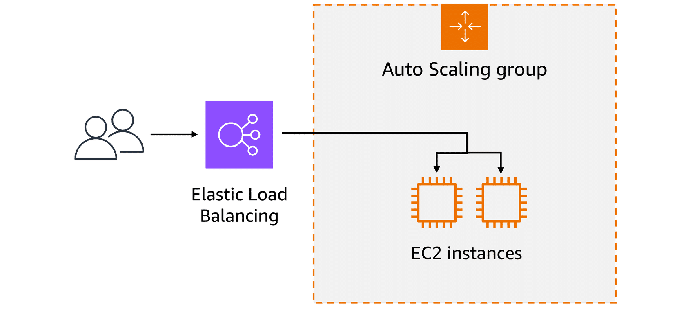
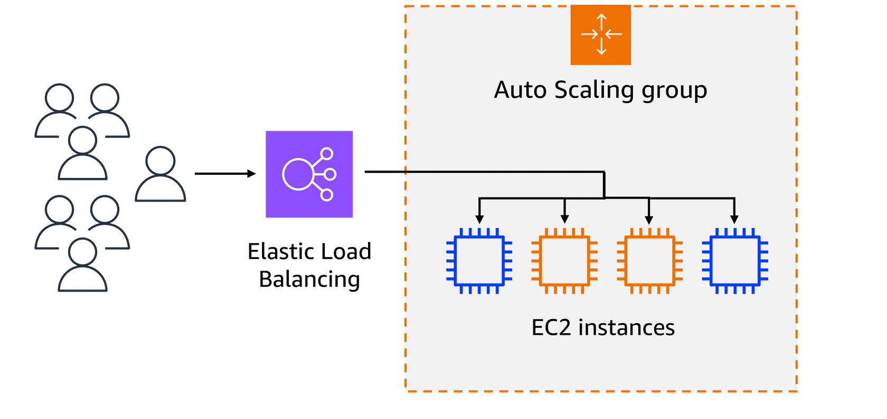
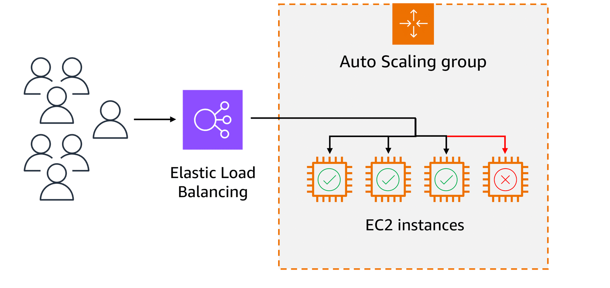
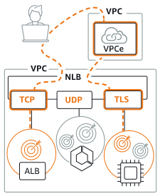

# Scaling Amazon EC2 with Elastic Load Balancing and Auto Scaling

Scalability is about a system’s potential to grow over time, whereas elasticity is about the dynamic, on-demand adjustment of resources. Together with **Amazon EC2 Auto Scaling** and **Elastic Load Balancing (ELB)**, AWS provides highly available, fault-tolerant, and cost-optimized scaling solutions.

---

## 1. Scaling Concepts

There are **two ways** to handle growing demands:  

- **Scaling Out (Horizontal Scaling)**  
  - Add more resources (instances) to the pool.  
  - Enables parallel processing and distributed load.  

- **Scaling Up (Vertical Scaling)**  
  - Add more power (CPU, memory) to an existing machine.  
  - Increases performance per instance but has physical limits.  

### ✅ Key Difference  
- **Scale Out**: More instances working in parallel.  
- **Scale Up**: Bigger, stronger instances.  

---

## 2. Elasticity with Auto Scaling

**EC2 Auto Scaling** automatically adjusts the number of EC2 instances based on demand.  

- **Scale Out**: Add instances during high demand.  
- **Scale In**: Remove instances when demand decreases.  

This ensures:
- Applications remain available and responsive.
- Resources are cost-optimized (pay only for what you use).  

### 🔧 How It Works
1. **Amazon CloudWatch** collects metrics (CPU, latency, etc.).  
2. When thresholds are breached, Auto Scaling launches or terminates instances.  
3. Desired number of healthy instances is always maintained.  

---

## 3. Elastic Load Balancing (ELB)

**Elastic Load Balancing** automatically distributes incoming traffic across multiple EC2 instances.  

- Acts as a **single point of entry** for web traffic.  
- Monitors instance health and only routes requests to healthy instances.  
- Scales seamlessly with demand.  

Although **ELB** and **EC2 Auto Scaling** are separate services, they complement each other to provide:  
- High availability.  
- Fault tolerance.  
- Consistent performance at scale.  

---

## 4. ELB Benefits

- **Efficient Traffic Distribution**  
  Prevents overload on a single instance by spreading requests evenly.  

- **Automatic Scaling**  
  Adjusts to demand as backend instances are added or removed.  

- **Simplified Management**  
  Handles failover, updates, and decouples front-end and back-end layers.  

---

## 5. ELB Routing Methods

ELB uses routing algorithms to optimize traffic distribution:  

- **Round Robin** → Cyclically distributes requests across servers.  
- **Least Connections** → Routes to the server with the fewest active connections.  
- **IP Hash** → Uses client IP for consistent routing to the same server.  
- **Least Response Time** → Routes to the server responding fastest.  

---

## 6. Real-World Example: Healthcare System

Consider a hospital’s online **appointment booking system**.  

- **Low-Demand Period**  
  Few patients are online → existing servers handle traffic → no scaling needed.  

  

---

- **High-Demand Period**  
  Surge in patients (e.g., early morning bookings) → Auto Scaling adds servers → ELB distributes requests → system remains fast and available.  

  

---

- **Load Balancer in Action**  
  ELB routes new requests to the least busy server.  
  Ensures no single EC2 instance becomes overloaded.  

  

---

## 🔑 Key Takeaways
- **Scalability** = Grow over time (scale up or out).  
- **Elasticity** = On-demand automatic scaling (cost efficiency).  
- **EC2 Auto Scaling** = Adds/removes instances based on demand.  
- **ELB** = Distributes traffic across healthy instances.  
- Together, they provide **resilient, high-performance, and cost-effective scaling**.  

# Types of Elastic Load Balancers in AWS

AWS offers **three main types of Elastic Load Balancers (ELB)**. Each operates at different layers of the OSI model and is designed for specific use cases.

---

## 1. Application Load Balancer (ALB)

- Operates at **Layer 7 (Application Layer)**.  
- Best for **HTTP and HTTPS traffic**.  
- Provides **advanced request-level routing**.  
- Supports microservices and container-based architectures.  

### ✅ Key Features
- Host-based routing (e.g., `api.example.com`, `app.example.com`).  
- Path-based routing (e.g., `/orders`, `/payments`).  
- Native support for **containerized apps** (ECS, EKS).  
- Advanced monitoring and visibility.  

<!-- White background + resize using  -->

  

---

## 2. Network Load Balancer (NLB)

- Operates at **Layer 4 (Transport Layer)**.  
- Designed for **ultra-high performance** and **low latency**.  
- Handles **TCP, UDP, and TLS traffic**.  
- Capable of managing **millions of requests per second**.  

### ✅ Key Features
- **Static IP addresses** (per AZ).  
- TLS offloading at scale.  
- Best for **gaming, IoT, or financial apps** needing extreme performance.  
- Very low latency (microseconds).  

### Example Diagram

  

---

## 3. Gateway Load Balancer (GWLB)

- Operates at **Layer 3 (Network Layer)**.  
- Designed for **deploying, scaling, and managing virtual appliances** (firewalls, intrusion detection, deep packet inspection, etc.).  
- Uses **GENEVE protocol** for encapsulation.  

### ✅ Key Features
- Seamlessly integrates third-party appliances.  
- Improves **security, compliance, and traffic inspection**.  
- Ideal for enterprise-grade **network security architectures**.  

### Example Diagram

  

---

## 🔑 Quick Comparison

| Feature                | ALB (App)          | NLB (Network)                | GWLB (Gateway)                   |
|-------------------------|--------------------|------------------------------|----------------------------------|
| OSI Layer              | Layer 7 (HTTP/HTTPS) | Layer 4 (TCP/UDP/TLS)        | Layer 3 (IP/Gateway)             |
| Best For               | Web apps, microservices | Extreme performance, low-latency apps | Security appliances              |
| Protocols              | HTTP, HTTPS        | TCP, UDP, TLS                | GENEVE                           |
| Performance            | High               | Millions of req/sec, ultra-low latency | Dependent on appliances          |
| Example Use Case       | Routing by path/host | Real-time trading systems, gaming | Firewall + traffic inspection    |

---

## ✅ When to Choose

- **Application Load Balancer (ALB):** Best for flexible routing of **web applications**.  
- **Network Load Balancer (NLB):** Best for **high-performance, latency-sensitive** applications.  
- **Gateway Load Balancer (GWLB):** Best when integrating **third-party security appliances**.  

# The 7 OSI Layers in Networking

| Layer | Name         | Main Function                                                                 | Examples                       |
| ----- | ------------ | ----------------------------------------------------------------------------- | ------------------------------ |
| 7     | Application  | End-user interaction with network services (apps use this layer)              | HTTP, FTP, SMTP, DNS           |
| 6     | Presentation | Data translation, encryption, compression                                     | SSL/TLS, JPEG, MPEG            |
| 5     | Session      | Establish, manage, and terminate connections between devices                  | NetBIOS, RPC                   |
| 4     | Transport    | Reliable delivery, error checking, flow control                               | TCP, UDP                       |
| 3     | Network      | Routing, addressing, deciding best path                                       | IP, ICMP, Routers              |
| 2     | Data Link    | Error detection (frames), MAC addressing, reliable link-to-link communication | Ethernet, PPP, Switches        |
| 1     | Physical     | Transmission of raw bits (electrical/optical/radio signals)                   | Cables, Hubs, Wi-Fi, Bluetooth |
