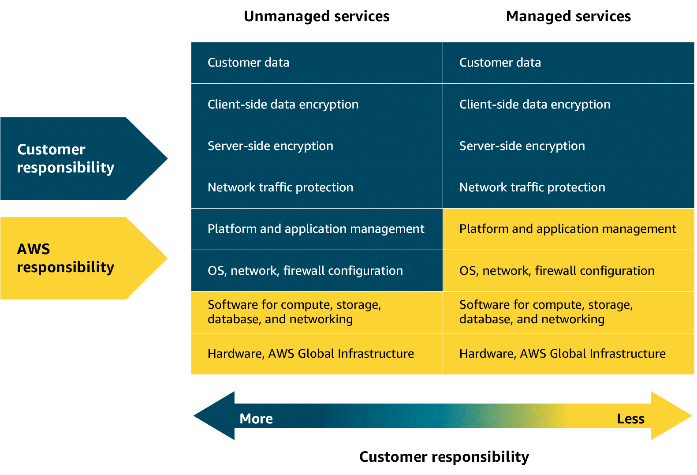

https://youtu.be/5rG-YgTHMC8?si=Ii3eP3mVFSA52aR-

# Amazon EC2 and AWS Compute Services

## Unmanaged and managed services

With unmanaged compute services like Amazon EC2, AWS takes care of the underlying physical infrastructure, but you're responsible for setting up, securing, and maintaining the operating system, network configurations, and applications on your instances. Managed services, on the other hand, reduce the amount of infrastructure you need to manage. While AWS handles much of the operational overhead, you might still need to perform some provisioning or configuration depending on the service.

  

## Fully-managed services

Fully-managed services—like serverless ones—take abstraction even further, eliminating the need to provision or manage any servers at all. The underlying infrastructure is fully managed by AWS, so you can focus entirely on writing and deploying code. Later in this module, you will explore Lambda. Lambda is a serverless compute service where AWS handles the infrastructure, scaling, and availability, while you remain responsible for securing and managing your application code.

  

---

## 1. Introduction to EC2

Amazon **EC2 (Elastic Compute Cloud)** instances are **virtual machines** that you can provision in the AWS Cloud.

* EC2 is versatile and can run workloads ranging from **basic web servers** to **high-performance computing**.
* It offers a **high degree of control** over your instances.

---

## 2. EC2 as an Unmanaged Service

* **Unmanaged** means **you are responsible** for managing tasks like:

  * Patching
  * Scaling
  * Managing the operating system

* **AWS responsibility**: underlying infrastructure (hardware, networking, etc.)

* **Your responsibility**: security *in* the cloud (OS, apps, configs)

* This aligns with the **Shared Responsibility Model**.

---

## 3. Managed vs. Unmanaged Services (Coffee Shop Analogy)

* **Unmanaged (EC2)** → like a **high-end espresso machine**

  * Full control (beans, grind, knobs, levers)
  * Highly customizable but more work (maintenance, upkeep)

* **Managed Services** → like a **coffee pod machine**

  * Quick, convenient, less hassle
  * Limited customization, but AWS handles smooth operation

👉 Choosing depends on whether you want **control** or **convenience**.

---

## 4. Managed AWS Services

Some AWS services reduce operational responsibility:

* **ELB (Elastic Load Balancer)**
* **SNS (Simple Notification Service)**
* **SQS (Simple Queue Service)**

For managed services:

* You configure requirements
* AWS ensures smooth operation over time
* **No server management required**

---

## 5. Serverless Computing

* **Serverless** = you cannot see or manage the underlying infrastructure.

* AWS handles:

  * Provisioning
  * Scaling
  * High availability
  * Maintenance

* You only focus on **building applications**.

---

## 6. AWS Compute Services Spectrum

AWS provides a **range of compute services**:

* **Unmanaged** (e.g., EC2) → maximum control
* **Managed** (e.g., ELB, SQS, SNS) → balance of config + convenience
* **Serverless** (e.g., Lambda) → complete abstraction from infrastructure

---

## 7. Key Takeaway

AWS offers different compute services to fit **varied workloads, requirements, and management preferences**.

* Identify **your application needs**
* Choose the right balance of **customization vs. ease of use**

---

Would you like me to make this into a **visually clear comparison table** (EC2 vs Managed vs Serverless) along with the coffee analogy?
